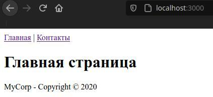
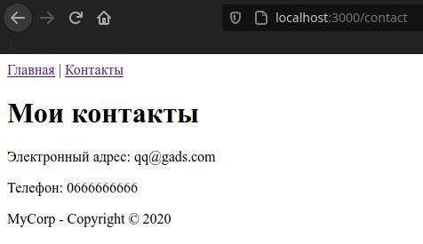

- [Частичные представления в Handlebars](#частичные-представления-в-handlebars)

# Частичные представления в Handlebars

На всех сайтах есть футер с контактами, номерами и прочим. Этот футер есть на каждой вкладке сайта, но очень тупо брать и копировать этот футер и вставлять его в каждую ветку сайта. 

Для решения этой проблемы есть частичные представления, которые представляют разделяемые общие элементы, которые можно добавлять на обычные представления.

Сделаем общее меню и общий футер. Для этого создадим для частичных представлений в проекте подкаталог `views/patrial`. 

В эту папку добавим файл `menu.hbs` с содержимым: 

```html
<nav><a href="/">Главная</a> | <a href="/contact">Контакты</a></nav>
```

В эту же папку добавим файл `footer.hbs` с содержимым: 

```html
<footer><p>MyCorp - Copyright © 2020</p></footer>
```

**Эти два файла добавлены для того, чтобы подключать их в каждой ветке странице.**

В папке `views` определим обычное представление `contact.hbs`:

```html
<!DOCTYPE html>
<html>
<head>
    <title>{{title}}</title>
    <meta charset="utf-8" />
</head>
<body>
    
    {{> menu}}
     
    <h1>{{title}}</h1>
    <p>Электронный адрес: {{email}}</p>
    <p>Телефон: {{phone}}</p>
     
    {{> footer}}

</body>
<html>
```

Для вставки этого частичного выражения используется запись `{{> fileName}}` без его расширения.

Также добавим в папку `views` новое представление `home.hbs`:

```html
<!DOCTYPE html>
<html>
<head>
    <title>Главная страница</title>
    <meta charset="utf-8" />
</head>
<body>

    {{> menu}}
    <h1>Главная страница</h1>
     
    {{> footer}}
    
</body>
<html>
```

Таким образом, есть два представления с общими элементами,  которые включаются в каждую ветку сайта без копирования. Если нужно добавить какой-то новый пункт меню, достаточно изменить файл `menu.hbs`.

Вся ветка проекта выглядит теперь так:

* `node_modules`
* `views`
  * `patrials`
    * `footer.hbs`
    * `menu.hbs`
  * `contact.hbs`
  * `home.hbs`
* `app.js`
* `package.json`
* `package-lock.json`

В конце изменим файл `app.js`:

```javascript
const express = require("express")
const hbs = require("hbs")
const app = express()

app.set("view engine", "hbs")

// Для настройки функционала частичных представлений
hbs.registerPartials(__dirname + "/views/patrials")


app.use("/contact", function (request, response) {

    response.render("contact", {
        title: "Мои контакты",
        email: "qq@gads.com",
        phone: "0666666666"
    })
})

app.use("/", function (request, response) {
    
    response.render("home.hbs")
})

app.listen(3000)
```

Теперь при обращению на адрес `/` или `contact` всегда будут видны два подключенных представления:




