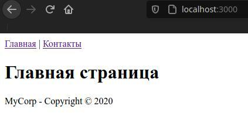

- [Layout в Handlebars](#layout-в-handlebars)
  - [Краткая суть работы](#краткая-суть-работы)

# Layout в Handlebars

Файл `layout` или мастер-страница позволяет определить общий макет всех веб-страниц сайта. Благодаря чему гораздо проще обновлять сайт, определять и менять какие-то общие блоки кода.

Для работы с файлами `layout` нужно установить в проект модуль `express-handlebars`:

```bash
npm i express-handlebars
```

Теперь в проекте определим папку `views/partials` с двумя частичными представлениями для меню и футера:

1. `menu.hbs`:

```html
<nav><a href="/">Главная</a> | <a href="/contact">Контакты</a></nav>
```

2. `footer.hbs`:

```html
<footer><p>MyCorp - Copyright © 2020</p></footer>
```

Создадим в папке `views` новую папку `layouts` и определим в ней файл `layout.hbs`, который будет определять макет сайта: 

```html
<!DOCTYPE html>
<html>
<head>
    <title>{{title}}</title>
    <meta charset="utf-8" />
</head>
<body>
    {{> menu}}
      
    <!-- Динамическое содержимое, которое меняется в зависимости от корня адресной строки -->
    {{{body}}}
      
    {{> footer}}
</body>
<html>
```

Здесь внедряются частичные представления `menu.hbs` и `footer.hbs`, которые будут видны на всех корнях сайта.

**И здесь также присутствует динамическое выражение `{{{body}}}`, в котором будет `html` содержимое в зависимости от адресной строки.**

Затем в папке `views` определим два обычных представления:

1. `contact.bhs`:

```html
<h1>{{title}}</h1>
<p>Электронный адрес: {{email}}</p>
<p>Телефон: {{phone}}</p>
```

2. `home.hbs`:

```html
<h1>Главная страница</h1>
```

Эти представления не содержат элементов `body`, `head` и т.д., это всё определено в файле `layout.hbs`.


Теперь определим файл `app.js`:

```javascript
const express = require("express")
const expressHbs = require("express-handlebars")
const hbs = require("hbs")
const app = express()


// Настройка движка hbs для использования файлов layout
app.engine("hbs", expressHbs (
    {
        layotsDir: "views/layouts",
        defaultLayout: "layout",
        extname: "hbs"
    }
))

app.set("view engine", "hbs")
hbs.registerPartials(__dirname + "views/patrials")


app.use("/contact", function (request, response) {
    
    response.render("contact", {
        title: "Мои контакты",
        email: "qq213@gmail",
        phone: "06666666666"
    })
})

app.use("/", function (request, response) {
    
    response.render("home.hbs")
})

app.listen(3000)
```

Функция `expressHbs` осуществляет конфигурацию движка. В примере три свойства: 

* `layoutsDir` задает путь к папке с файлами `layout` относительно корня каталога проекта. 
* `defaultLayout` указывает на название файла, который будет использоваться в качестве мастер-страницы (`layout.hbs`)
* `extname` задает расширение файлов.


В итоге, весь проект выглядит следующим образом: 


И вот так выглядит в браузере, на вид тоже самое, что и в 13-й теме, но по факту здесь динамическое центральное содержимое: 



***

## Краткая суть работы
При переходе на адрес `localhost:3000/` логика следующая:

* срабатывает `app.use("/")`, в котором: 
  *  рендерится файл `home.hbs`;
  *  который в свою очередь лежит в файле `layout.hsb`, который и является главым `html` файлом.

С `localhost:3000/contact` тоже самое и делать такую вот "цепочку" становится очень просто и логично.