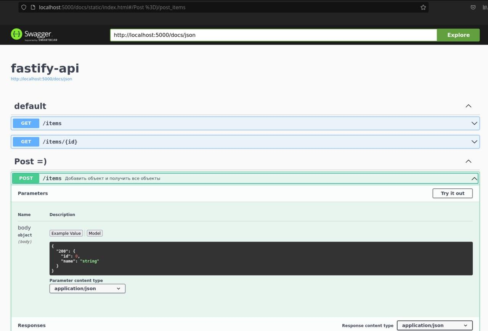

# Fastify

- [Fastify](#fastify)
  - [Создание сервера](#создание-сервера)
    - [Установка](#установка)
    - [Создание](#создание)
  - [Роуты](#роуты)
    - [Базовые роуты](#базовые-роуты)
    - [Роуты с параметрами](#роуты-с-параметрами)
    - [Роутинг](#роутинг)
  - [Валидация](#валидация)
    - [Возвращаемые данные](#возвращаемые-данные)
    - [Входящие параметры](#входящие-параметры)
  - [Тест запросов fastify-swagger](#тест-запросов-fastify-swagger)
    - [Запуск](#запуск)
    - [Подпись запросов](#подпись-запросов)

Fastify - подобие экспресса, только более быстрый в плане запросов и прочего. 
***

## Создание сервера

### Установка

```bash
npm i fastify fastify-swagger
```

### Создание 

```js
import fast from 'fastify'
// будет ли много консолей от фастифая
const fastify = fast({ logger: true }) 

const PORT = 5000

const start = async () => {
  try {
    await fastify.listen(PORT)
  } catch (err) {
    fastify.log.error(err)
    process.exit(1)
  }
}

start()
```

При запуске сервера появится следующая консоль: 

```json
{
	"level":30,
	"time":1634214899297,
	"pid":7434,
	"hostname":"vladislav-ms7c02",
	"msg":"Server listening at http://127.0.0.1:5000"
}
```
***

## Роуты

### Базовые роуты

Для построения запроса используется почти такая же конструкция, как в `express`.

Отправка `get` запроса: 

```js
fastify.get('/items', (req, reply) => {
  reply.send({ test: 'Darova' })
})
```

Отправка `post` запроса с получением и отправкой данных: 

```js
fastify.post('/items', (req, reply) => {
	// получение body через req.body
  const data = req.body
  items.push(data)
  reply.send(items)
})
```

Возможны такие же запросы: `post`, `put` и т.д..

### Роуты с параметрами

```js
fastify.get('/items/:id', (req, reply) => {
	// получение параметров через req.params
  const { id } = req.params
  const item = items.find((item) => item.id === id)

  reply.send(item)
})
```

### Роутинг 

Для роутинга из файлов нужно создать функцию в экспортируемом файле с тремя параметрами: 
1. `fastify` - сам фастифай
2. `options` - для валидации
3. `done` - для регистрации роутов

Функция с роутами: 

```js
// ./routes/items.js

export function itemRoutes(fastify, options, done) {
  fastify.get('/items', (req, reply) => {
    reply.send({ test: 'Darova' })
  })

  fastify.get('/items/:id', (req, reply) => {
    const { id } = req.params
    const item = items.find((item) => item.id === id)

    reply.send(item)
  })

  fastify.post('/items', (req, reply) => {
    const data = req.body
    items.push(data)
    reply.send(items)
  })

  done()
}
```

Регистрируем роуты: 

```js
// server.js

import { itemRoutes } from './routes/items.js'

fastify.register(itemRoutes)
```
***

## Валидация

### Возвращаемые данные

Для валидации используется объект-схема с описываемыми параметрами: 

```js
const getItemsOpts = {
  schema: {
    response: {
      200: {
        type: 'array',
        items: {
          type: 'object',
          properties: {
            id: { type: 'string' },
            name: { type: 'string' },
          },
        },
      },
    },
  },
}
```

И используем эту схему для валидации в роуте: 

```js
fastify.post('/items', getItemsOpts, (req, reply) => {
 const data = req.body
 items.push(data)
 reply.send(items)
})
```

Есть **возможность** передать только конкретный параметр из нескольких, как в `GraphQL`: 

```js
// ...
properties: {
	id: { type: 'string' },
// name: { type: 'string' },
},
```

И также можно изменить тип передаваемого значения, типо со строки в число (если возможно): 

```js
properties: {
	id: { type: 'integer' },
},
```

Также можно в один этот объект запихивать сам запрос: 

```js
const getItemsOpts = {
  schema: {
    response: {
      200: {
        type: 'array',
        items: {
          type: 'object',
          properties: {
            id: { type: 'integer' },
            name: { type: 'string' },
          },
        },
      },
    },
  },
  handler: (req, reply) => {
    const data = req.body
    items.push(data)
    reply.send(items)
  },
}

fastify.post('/items', getItemsOpts)
```

### Входящие параметры

Для этого описываем `body` в объекте: 

```js
const addItems = (req, reply) => {
  const data = req.body
  items.push(data)
  reply.send(items)
}


const getItemsOpts = {
  schema: {
    body: {
      200: {
        type: 'object',
        required: ['id', 'name'], // массив с ключами объекта
        properties: {
          // описываем каждый key and value
          id: { type: 'integer' },
          name: { type: 'string' },
        },
      },
    },
  },
  handler: addItems,
}
```
***

## Тест запросов fastify-swagger

Напоминает апишку `GraphQL`, где можно посмотреть все свои запросы и проверить их руками. 

### Запуск

Сваггер должен быть зарегистрирован **до** всех роутов, тогда он сработает. 

```js
import fastifySwagger from 'fastify-swagger'

fastify.register(fastifySwagger, {
  schema: {
    tags: ['dsds'],
    summary: 'dsdsdsd',
  },
  exposeRoute: true,
  routePrefix: '/docs',
  swagger: {
    info: { title: 'fastify-api' },
  },
})
```

Заходим на адрес `localhost:PORT/docs` и увидим такой UI: 



Здесь можно увидеть все запросы, тыкнуть на них и проверить на работоспособность. Также можно указать `body` и т.д. 

### Подпись запросов

Запросы можно подписывать, описывать. Для этого нужно описать объект со схемой: 

```js
schema: {
 tags: ['Post =)'], // Тег запроса
 summary: 'Добавить объект и получить все объекты',
 body: {
   200: {
     type: 'object',
     required: ['id', 'name'],
     properties: {
       id: { 
        type: 'integer',
        description: "user's id " // надо разобраться
       },
       name: { type: 'string' },
     },
   },
 },
},
```
