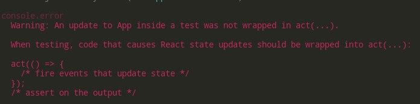

- [React-Testing-Library](#react-testing-library)
  - [Пример работы](#пример-работы)
  - [Поисковые варианты](#поисковые-варианты)
    - [getBy](#getby)
    - [queryBy](#queryby)
    - [findBy](#findby)
    - [Таблица оптимального использования](#таблица-оптимального-использования)
    - [Фикс предупреждения об асинхронности](#фикс-предупреждения-об-асинхронности)
  - [Утверждения](#утверждения)
    - [Подробный гайд](#подробный-гайд)
  - [fireEvent событие](#fireevent-событие)
  - [userEvent событие](#userevent-событие)
  - [Разные способы тестирования](#разные-способы-тестирования)

# React-Testing-Library

Эта библиотека опирается не на саму отрисовку, а на текст внутри этой отрисовки используя регулярные выражения.

Библиотека установлена по дефолту в приложение React (TS). Никаких доп. установок не требуется. 

Весь функционал работает вместе с `jest`.
***

## Пример работы

Здесь поиск лишь по конкретному тексту в компоненте: 

```tsx
import React from 'react'
import { render, screen } from '@testing-library/react'
import App from './App'

describe('App', () => {
  it('renders to the text', () => {

    render(<App />) // за каким компонентом наблюдать
    screen.debug() // показывает саму структуру компонента

    // Ищем просто тексты в документе
    expect(screen.getByText(/hello/i)).toBeInTheDocument()
    expect(screen.getByText(/Какая-то инфа/i)).toBeInTheDocument()
  })
})
```
***

## Поисковые варианты

### getBy

Если нужно найти элемент - используем `getBy`: 

```js
// поиск по тексту
.getByText(/kravich/i) 

// жмём ctrl+space и получаем список ролей (роль элемента)
.getByRole("button") 

// ищет текст в теге label
.getByLabelText(/Ваше имя/i)

// ищет текст в placeholder интпута
.getByPlaceholderText("Введите сообщение...")

// ищет текст по атрибуту alt у тега img
.getByAltText("нет картинки")

// ищет значение value, применяется для проверки дефолтного значения
.getByDisplayValue("Default value")

// найти много элементов
.getAllByМетод("value")
```
***

### queryBy

Если нужно показать, что элемента нет - используем `queryBy`:

```js
.queryByText(/kravich/) 
.queryByRole("button") 
.queryByLabelText(/Ваше имя/i)
.queryByPlaceholderText("Введите сообщение...")
.queryByAltText("нет картинки")
.queryByDisplayValue("Default value")
.queryAllByМетод("value")
```

Есть код, в котором меняем состояние и в зависимости от этого состояния может появляться разный текст: 

```tsx
const App: React.FC = () => {
  const [pState, setPState] = useState<boolean>(false)

  return (
    <div className="App">
      <p>{pState ? 'Max' : 'Vlad'} Kravich</p>
      <button onClick={(): void => setPState(true)}>Нажми</button>
    </div>
  )
}
```

Тестирования, что элемента действительно нет в разметке: 

```tsx
it('renders to search variants', () => {
  render(<App />)  

  // Такого текста ещё нет
  expect(screen.queryByText(/Max Kravich/i)).toBeNull() 
})
```
***

### findBy

Метод `findBy` используется для поиска асинхронных элементов, которых изначательно в разметке не было, но после асинхронного кода они появятся: 

```js
.findByByText(/kravich/) 
.findByByRole("button") 
.findByByLabelText(/Ваше имя/i)
.findByByPlaceholderText("Введите сообщение...")
.findByByAltText("нет картинки")
.findByByDisplayValue("Default value")
.findByAllByМетод("value")
```

Код с промисом, который вернёт значение и `useEffect`, который изменит стейт из промиса и покажет элемент после того, как стейт изменился:

```tsx
const getUser = (): Promise<string> => Promise.resolve('Max')

const App: React.FC = () => {
  const [user, setUser] = useState<string>('')

  useEffect((): void => {
    const loadUser = async (): Promise<void> => {
      try {
        const userData = await getUser()
        setUser(userData)
      } catch (err) { return }
    }
    loadUser()
  }, [setUser])

  return (
    <div className="App">
      <div className="async-test">
        {user && <h2>Logged in as {user}</h2>}
      </div>
    </div>
  )
}
```

Тест: 

```tsx
it('renders async elem', async () => {
  render(<App />)

  // Проверка, что такой строки изначательн нет
  expect(screen.queryByText(/Logged in as/i)).toBeNull()

  // После асинхронного изменения стейта проверяем, что такая строка есть
  expect(await screen.findByText(/Logged in as/i)).toBeInTheDocument()
  screen.debug()
})
```

### Таблица оптимального использования

| | Нет совпадений | 1 совпадение  | 1+ совпадение  | Await? | 
| ------- | --- | --- | --- | --- | 
| `getBy` | throw | return | throw | Нет |
| `findBy` | throw | return | throw | Нет |
| `queryBy` | null | return | throw | Да |
| `getAllBy` | throw | array | array | Нет |
| `findAllBy` | throw | array | array | Да |
| `queryAllBy` | [] | array | array | Нет |
***

### Фикс предупреждения об асинхронности



В предупреждении говорится, что компонент участвует в асинхронных действиях (`useEffect`, `click` и т.д.).

Для решения проблемы нужно для каждого асинхронного элемента в разметке вписать метод `findBy`: 

```tsx
beforeEach(async () => {
    render(<App />)

    // этот элемент в разметке является асинхронным
    // ошибка при await уйдет
    await screen.findByText(/Logged in as/i) 
  })
```

***
## Утверждения

Утверждения - это то, что стоит справа от выражения:

```tsx
expect(Поисковый тип).toBeInTheDocument()
```

Основные: 

```js

.toBeDisabled()         // - отключён (hidden true / display: none;)
.toBeEnabled()          // - включён (hidden: false / display: block;)
.toBeEmptyDOMElement()  // - пустой элемент
.toBeRequired()         // - есть атрибут required
.toContainElement()     // - содержит внутри элемент
.toBeInTheDocument()    // - существует в разметке
.toBeValid()            // - действительный
.toBeEmpty()            // - пустой
.toBeInvalid()          // - недействительный
.toBeVisible()          // - видимый
```

Второстепенные: 

```js
// - содержит элемент внутри
.toContainElement(element: HTMLElement)     

.toContainHTML("<p>6S</p>")   // - содержит InnerHTML
.toHaveAttribute("id")        // - есть атрибут id
.toHaveClass("kravich")       // - есть класс kravich
.toHaveFocus()                // - есть фокус на элементе
.toHaveFormValues()           // - имеет values формы
.toHaveStyle('display: none') // - имеет стиль display: none;
.toHaveTextContent()          // - имеет textContent
.toHaveValue()                // - имеет value
.toHaveDisplayValue()         // - имеет дефолтный value
.toBeChecked()                // - отмечен ли данный элемент (checkbox)
.toBePartiallyChecked()       // - частично ли отмечен (гайд)
.toHaveDescription()          // - гайд
```

### Подробный гайд

Очень подробно про все методы: <a href="https://github.com/testing-library/jest-dom">GitHub</a>
***

## fireEvent событие

Для симуляции события (`click` и т.д.) применяется `fireEvent`.

Есть код реакта, где по нажатию на кнопку меняется стейт и в зависимости от стейта показывается определенный текст:

```tsx
const App: React.FC = () => {
  const [pState, setPState] = useState<boolean>(false)
  return (
    <div className="App">
        <p>{pState ? 'Max' : 'Vlad'} Kravich</p>
        <button onClick={(): void => setPState(true)}>Нажми</button>
    </div>
  )
}
```

В `fireEvent` симулируем нажатие кнопки и смотрим, что изменилось с помощью `.debug()`:

```tsx
describe('fireEvents', () => {
  test('emulation click', () => {
    render(<App />)

    screen.debug()

    // Элемента нет
    expect(screen.queryByText(/Max Kravich/i)).toBeNull()

    fireEvent.click(screen.getByRole('button'))

    // После клика на кнопку он появился
    expect(screen.queryByText(/Max Kravich/i)).toBeInTheDocument()

    screen.debug()
  })
})
```

Результат до клика в разметке:

```html
<p>Vlad Kravich</p>
```

Результат после клика:

```html
<p>Max Kravich</p>
```
***

## userEvent событие

Основное отличие `userEvent` от `fireEvent` в том, что оно более точно позволяет более точно имитировать поведение браузера. Позволяет описать такие события как `keyUp`, нажата ли клавиша `ctrl` и т.д. т.п.. Т.е. это более точный инструмент для теста событий.

Пример с введенным текстом в `input`: 

```tsx
test('input value', () => {
  userEvent.type(screen.getByRole("textbox"), "React")

})
```

Пример с выбором `checkbox`:

```tsx
it('checkbox click', () => {
  const handleChange = jest.fn()
  const { container } = render(
    <input type="checkbox" onChange={handleChange} />
  )
  const checkbox: ChildNode | any = container.firstChild

  // элемент не выбран
  expect(checkbox).not.toBeChecked()
  // нажали на элемент с клавишами ctrl и shift
  userEvent.click(checkbox, { ctrlKey: true, shiftKey: true })
  // элемент выбран
  expect(checkbox).toBeChecked()
})
```

Пример с двойным кликом:

```tsx
it('double click', () => {
  const onChange = jest.fn()
  const { container } = render(<input type="checkbox" onChange={onChange} />)
  const checkbox: ChildNode | any = container.firstChild

  // элемент не выбран
  expect(checkbox).not.toBeChecked()
  userEvent.dblClick(checkbox)

  // вызвали 2 раза
  expect(onChange).toHaveBeenCalledTimes(2)
})
```

Пример с фокусом на `input`: 

```tsx
it('input focus', () => {
  const { getAllByTestId } = render(
    <div>
      <input data-testid="elem" type="checkbox" />
      <input data-testid="elem" type="radio" />
      <input data-testid="elem" type="number" />
    </div>
  )

  // массив из трёх инпутов по порядку
  const [checkbox, radio, number] = getAllByTestId('elem')

  // сделали фокус по таб
  userEvent.tab()
  // элемент выбран
  expect(checkbox).toHaveFocus()

  // ... тоже самое
  userEvent.tab()
  expect(radio).toHaveFocus()
  userEvent.tab()
  expect(number).toHaveFocus()
})
```
***

## Разные способы тестирования

Для тестирования элементов их можно "доставать" двумя разными способами.

1-й: достаём элемент с помощью `container.firstChild` и работаем с ним:

```jsx
it('checkbox click', () => {
  const handleChange = jest.fn()
  const { container } = render(
    <input type="checkbox" onChange={handleChange} />
  )
  const checkbox: ChildNode | null = container.firstChild

  // не выбран
  expect(checkbox).not.toBeChecked()
  fireEvent.click(checkbox!)
  // выбран
  expect(checkbox).toBeChecked()
})
```

2-й: присваиваем элементу атрибут `data-testid` с его айдишником и обращаемся к этому элементу методом `getByTestId('id')`:

```jsx
it('input focus', () => {
  const { getByTestId } = render(
    <input type="checkbox" data-testid="focus-test" />
  )

  const input: HTMLElement = getByTestId('focus-test')

  // не в фокусе
  expect(input).not.toHaveFocus()
  input.focus() 
  // в фокусе
  expect(input).toHaveFocus()
})
```