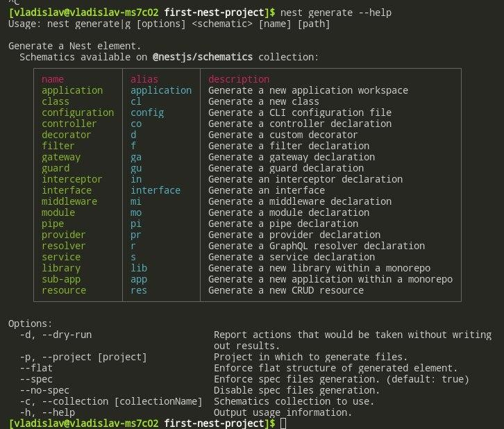
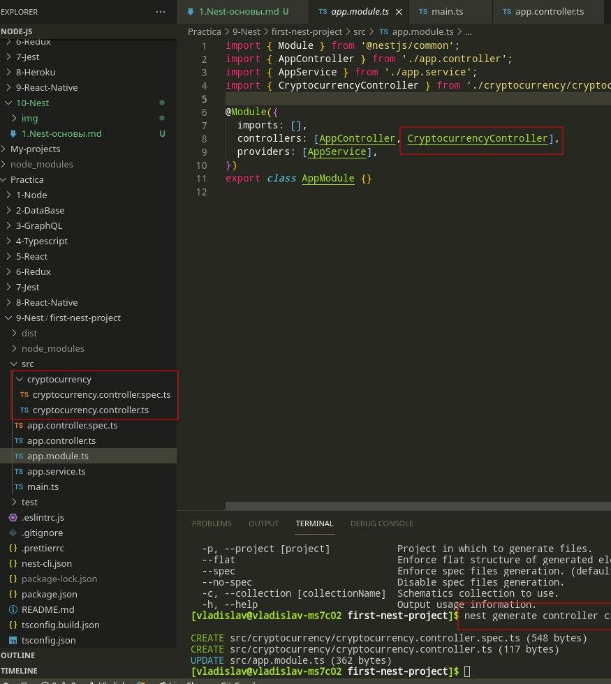

# Основы Nest

- [Основы Nest](#основы-nest)
  - [Установка](#установка)
    - [Основное](#основное)
    - [Создание компонентов командами](#создание-компонентов-командами)
  - [Работа с контроллером](#работа-с-контроллером)
    - [Методы запроса](#методы-запроса)
    - [Прочие методы](#прочие-методы)
  - [Получение Body - Dto](#получение-body---dto)
  - [Сервисы](#сервисы)
  - [Модули](#модули)
  - [Работа с mongoose](#работа-с-mongoose)
  - [Pipes](#pipes)
    - [Встроенные методы](#встроенные-методы)
    - [Использование внутри запроса](#использование-внутри-запроса)
    - [Собственный Pipe](#собственный-pipe)


## Установка

Устанавливаем глобально и создаём папку с проектом: 

```bash
sudo npm i - g @nestjs/cli
nest new first-nest-project
```

### Основное

### Создание компонентов командами

Можно создать разные компоненты спец. командами Nest, а не руками.

К примеру: 

```bash
nest generate --help
```



И командой...

```bash
nest generate controller name
```

...можно создать нужный файл, который уже импортирован в `app.module.ts`: 


***

## Работа с контроллером

Контроллер работает со всеми входящими запросами от клиента. 

Как на скрине выше - `CryptocurrencyController` уже импортирован во все контроллеры приложения.

### Методы запроса

Создаём контроллер: 

```ts
// cryptocurrency.controller.ts

import { Controller, Get } from '@nestjs/common';

@Controller('cryptocurrency')
export class CryptocurrencyController {
  @Get()
  getAll() {
    return [{ ticker: 'ETH', fullName: 'Ethereum' }];
  }
}
```

* `@Controller('cryptocurrency')` - указывает конкретный роут
* `@Get()` - указывает тип запроса

Подключаем внутрь модуля: 

```ts
// app.service.ts

@Module({
  ...,
  controllers: [AppController, CryptocurrencyController],
})
```

Получение динамического параметра обычным способом: 

```ts
@Get(':ticker')
getOne(@Param() params) {
  return `Ticker: ${params.ticker}`;
}
```

И правильным способом: 

```ts
@Get(':ticker')
getOne(@Param('ticker') ticker: string) {
  return `Ticker: ${ticker}`;
}
```

Т.е. просто говорим, какой конкретно параметр ожидается внутри `@Param()` и получаем его напрямую в аргументе. 

### Прочие методы

* `@Redirect(url, code)` - делает редирект. 
  
* `@HttpCode(code)` - отправляет статус код в случае удачного запроса. Используется в связке с `HttpStatus.that`, который имеет различные и понятные статус коды. 
* `@Header(name, value)` - получение заголовка.
***

## Получение Body - Dto

Можно было бы просто указать поулчаемый тип `body` в аргументах:

```ts
@Post()
addCoin(@Body() body) {
  return body
}
```

Но так неправильно и нужно описывать конкретно то, что приходит от клиента. Для этого нужна правильная структура в виде Dto.

Правильно создавать папку `dto`, и в ней для каждого запроса создавать отдельный файл с типом и описывать его классом.

Описываем входящие параметры: 

```ts
// create-coin.dto.ts

export class CreateCoinDto {
  readonly ticker: string;
  readonly fullName: string;
  readonly price: number;
}
```

И подключаем этот класс к `body` как его тип: 

```ts
@Post()
addCoin(@Body() createCoin: CreateCoinDto) {
  return createCoin;
}

@Put(':ticker')
updateCoin(
  @Body() updateCoin: UpdateCoinDto,
  @Param('ticker') ticker: string,
) {
  if (ticker.toLocaleUpperCase() === 'ETH') {
    return { ticker: 'ETH', fullName: 'Ethereum', price: updateCoin.price };
  }

  return 'Failed';
}
```
***

## Сервисы

Используются для описания всей логики каждого запроса в контроллере. 

Описываем его в отдельном файле рядом с контроллером:

```ts
// cryptocurrency.service.ts

import { Injectable } from '@nestjs/common';
import { CreateCoinDto } from './dto/create-coin.dto';

@Injectable()
export class CryptocurrencyService {
  private coins = [];

  getAll() {
    return this.coins;
  }

  getByTicker(ticker: string) {
    return this.coins.find((coin) => coin.ticker === ticker);
  }

  create(coinData: CreateCoinDto) {
    return this.coins.push({ id: Date.now().toString(), ...coinData });
  }
}
```

Подключаем внутрь модуля: 

```ts
// app.service.ts

@Module({
  ...,
  providers: [AppService, CryptocurrencyService],
})
```

Используем внутри контроллера: 

```ts
// cryptocurrency.controller.ts

@Controller('cryptocurrency')
export class CryptocurrencyController {
  constructor(private readonly cryptocurrencyService: CryptocurrencyService) {}

  @Get()
  getCoins() {
    return this.cryptocurrencyService.getAll();
  }
}
```
***

## Модули

При инициализациии проекта модуль `app.module.ts` имеет следующее:

```ts
// app.module.ts

@Module({
  imports: [],
  controllers: [AppController],
  providers: [AppService],
})
export class AppModule {}
```

И по мере написания проекта - контроллеров и провайдеров всё больше. Конечно, их можно просто дописать в массивы зависимостей: 

```ts
// app.module.ts

@Module({
  imports: [],
  controllers: [AppController, CryptocurrencyController],
  providers: [AppService, CryptocurrencyService],
})
export class AppModule {}
```

Но это не есть хорошо, потому что очень сложно будет понять, что за что отвечает и т.д. 

Правильное решение - создавать новые модули для каждого типа контроллеров и сервисов, а затем просто добавлять этот готовый модуль в самый главный.

Создал конкретный модуль и подключил в него то, что относится только к нему:

```ts
// cryptocurrency.module.ts

@Module({
  providers: [CryptocurrencyService],
  controllers: [CryptocurrencyController],
})
export class CryptocurrencyModule {}
```

И подключил этот модуль к самому главному модулю:

```ts
// app.module.ts

@Module({
  imports: [CryptocurrencyModule],
  controllers: [AppController],
  providers: [AppService],
})
export class AppModule {}
```
***

## Работа с mongoose

Установка пакетов:

```bash
npm i @nestjs/mongoose mongoose
```

Создаём саму схему: 

```ts
// cryptocurrency.schema.ts

import { Prop, Schema, SchemaFactory } from '@nestjs/mongoose';
import { Document } from 'mongoose';

export type CryptocurrencyDocument = Cryptocurrency & Document;

@Schema()
export class Cryptocurrency {
  @Prop()
  ticker: string;

  @Prop()
  fullName: string;

  @Prop()
  price: number;
}

export const CryptocurrencySchema =
  SchemaFactory.createForClass(Cryptocurrency);
```

В главном модуле инициализируем подключение к бд: 

```ts
// app.module.ts

@Module({
  imports: [
    CryptocurrencyModule,
    MongooseModule.forRoot(uri),
  ],
  controllers: [AppController],
  providers: [AppService],
})
export class AppModule {}
```

Добавляем схему в инициализацию самого модуля: 

```ts
// cryptocurrency.module.ts

@Module({
  providers: [CryptocurrencyService],
  controllers: [CryptocurrencyController],
  imports: [
    MongooseModule.forFeature([
      { name: Cryptocurrency.name, schema: CryptocurrencySchema },
    ]),
  ],
})
export class CryptocurrencyModule {}
```

И используем эту схему в контроллере, описав её в конструкторе: 

```ts
// cryptocurrency.service.ts

@Injectable()
export class CryptocurrencyService {
  constructor(
    @InjectModel(Cryptocurrency.name)
    private cryptocurrencyModel: Model<CryptocurrencyDocument>,
  ) {}

  getAll(): Promise<Cryptocurrency[]> {
    return this.cryptocurrencyModel.find().exec();
  }
}
```
***

## Pipes

Служат своего рода валидатором или же преобразованием данных (к примеру из числа в строку), который предоставляет встроенные методы или позволяет писать кастомные.  

### Встроенные методы

* `ValidationPipe` 
* `ParseIntPipe` 
* `ParseFloatPipe`
* `ParseBoolPipe`
* `ParseArrayPipe`
* `ParseUUIDPipe`
* `ParseEnumPipe`
* `DefaultValuePipe`

### Использование внутри запроса

Работает внутри `body`, `param` и т.д.. 


Указываем, что ожидается число:

```ts
// cryptocurrency.controller.ts

@Get(':id')
getCoin(@Param('id', ParseIntPipe) id: string) {
  return this.cryptocurrencyService.getById(id);
}
```

Если не число - вылетает ошибка:

```json
{
  "statusCode": 400,
  "message": "Validation failed (numeric string is expected)",
  "error": "Bad Request"
}
```

Для модификации ошибки под собственные нужны юзаем следующее:

```ts
@Get(':id')
getCoin(@Param('id', new ParseIntPipe({errorHttpStatusCode: code})) id: string) {
  return this.cryptocurrencyService.getById(id);
}
```


### Собственный Pipe

```ts
// cryptocurrency.pipe.ts

import { ArgumentMetadata, Injectable, PipeTransform } from '@nestjs/common';

@Injectable()
export class CryptocurrencyPipe implements PipeTransform {
  transform(value: any, metadata: ArgumentMetadata) {
    console.log(value)
    // делаем что-то с данными и можем возвращать что угодно
    return value;
  }
}
```