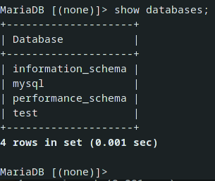
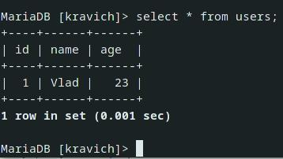

# Реляционная DataBase - MySQL и MariaDB. Установка, запуск, команды и типы данных.

## Установка и запуск

Открываем терминал где угодно и далее по пунктам: 

1. `sudo pacman -S mysql` или `sudo pacman -S mariadb`
2. Если предложен выбор - выбрать первый вариант.
3. `sudo systemctl start mysqld` | (здесь у меня была ошибка).
4. Если есть ошибка, вводим `sudo mysql_install_db --user=mysql --basedir=/usr --datadir=/var/lib/mysql`
5. `sudo systemctl start mysqld && sudo mysql_secure_installation`
    * в терминале будет сказано, что команда создала двух юзеров: `root@localhost` и 
`mysql@localhost`, оба без паролей по дефолту, жмём просто ENTER. *
6. После ENTER будет предложено ответить на некоторые вопросы:
    1. Жмём `n`
    2. Предложит поставить другой пароль (вместо пустого *), `n`
    3. Удаление тестового юзера созданного по дефолту, `Y`
    4. Запрет коннектиться из инета к нашей БД, `Y`
    5. Удаление дефолтной базы для тестирования, создадим её сами, `Y`
    6. Подтвердить все изменения, `Y`
7. (sudo) | `mysql -u root -p`. Вводим пароль, который был выбран при установке.

Для запуска БД вводим следующее: 

1. Включить SQL-сервер: `sudo systemctl start mysqld`
2. Вход в БД: (sudo) | `mysql -u root -p`
***

## Использование и команды

**Все команды должны заканчиваться со знаком точки с запятой `;`**

Все команды не чувствительны к регистру, т.е. их писать можно как угодно.

Обращение к названиям БД и таблиц пишутся ровно так, как были заданы: `Kravich` - `Kravich`.


* ### `show databases;`

    Просмотр всех баз данных на сервере.

    

* ### `create database kravich;` 

    Создание базы данных с именем `kravich`.

* ### `use kravich;` 

    Обращение к нужной базе данных, указывается название нужной БД, к которой требуется обращение и последующая работа с ней.

* ### `create table` 

    Создание таблицы в этой базе данных: 

    ```sql
    # Создание таблицы users внутри БД kravich
    create table users (
        id integer auto_increment primary key, 
        name varchar(30), 
        age integer # integer - целое число
    );
    ```

* ### `show tables;` 

    Просмотр таблиц текущей БД.

* ### `insert into users (name, age) values ("Vlad", 23);` 

    Добавление строки согласно столбцам таблицы в эту самую таблицу.

* ### `select * from users;` 

    Получение добавленных данных: 

    

* ### `rename table old_name to new_name;` 

    Переименование таблицы `name` в `newName`.

* ### `drop database name;`

    Удаление созданной БД.

* ### `truncate table name;`

    Полное удаление данных всей таблицы (удаляет все столбы).

* ### `drop table name;`

    Удаление таблицы из БД.
***

## Типы данных

При определении столбов таблицы необходимо указывать тип данных для каждого столба. Тип данных определяет значения, которые могут храниться в столбце и сколько они будут занимать места в памяти.

### Символьные типы: 
* `CHAR` - представляет строку фиксированной длины.

    Длина строки указывается в круглых скобках: `CHAR(10)` - строка из десяти символов. Если в данный столбец указывается строкам, к примеру, из 6 символов - то строка дополняется 4 пробелами и в итоге строка всё равно будет занимать 10 символов.

* `VARCHAR` - представляет строку переменной длины.

    Длина строки также указывается в круглых скобках: `VARCHAR(10)`. Отличие от `CHAR` в том, что строка займет ровно столько места, сколько ей было задано. Строка из 6 символов займет ровно 6 символов из 10 возможных.

`CHAR` и `VARCHAR` по дефолту используют кодировку UTF-8, которая позволяет использовать до 3 байт хранения символа в зависимости от языка.

Ряд дополнительных типов данных представляют текст неопределенной длины: 

* `TINYTEXT` - представляет текст длиной до 255 байт.

* `TEXT` - представляет текст длиной до 65 КБ.
* `MEDIUMTEXT` - представляет текст длиной до 16 МБ.
* `LARGETEXT` - представляет текст длиной до 4 ГБ.

### Числовые типы: 

* `TINYINT` - представляет целые числа от -127 до 128, занимает 1 байт.

* `SMALLINT` - представляет целые числа от -32768 до 32767, занимает 2 байтa.
* `MEDIUMINT` - представляет целые числа от -8388608 до 8388607, занимает 3 байта.
* `INT` - представляет целые числа от -2147483648 до 2147483647, занимает 4 байта.
* `DECIMAL` - хранит числа с фиксированной точностью. Принимает два параметра: `DECIMAL(precision, scale)`. 
    1. `precision` - максимальное хранимое число, диапазон от 1 до 65.
    2. `scale` - максимальное хранимое кол-во цифр после запятой. По дефолту 0.
    * может хранить значения из диапазона от -999.99 до 999.99. 
* `FLOAT` - хранит дробные числа с плавающей точкой одинарной точности от -3.4028 * 1038 до 3.4028 * 1038, занимает 4 байта, принимает форму `FLOAT(M,D)`, где `M` - общее количество цифр, а `D` - количество цифр после запятой.
* `DOUBLE` - хранит дробные числа с плавающей точкой двойной точности от -1.7976 * 10308 до 1.7976 * 10308, занимает 8 байт, принимает форму `DOUBLE(M,D)`, где `M` - общее количество цифр, а `D` - количество цифр после запятой.

Добавление `UNSIGNED` после типа представляет числа от 0 до `numb * 2`. Например `TYNYINT UNSIGNED` будет принимать число от 0 до 256 (128 * 2).

### Типы для работы с датой и времени:

* `DATE` - хранит даты с 1 января 1000 года до 31 декабря 9999 года (c "1000-01-01" до "9999-12-31"). По дефолту для хранения используется формат yyyy-mm-dd. Занимает 3 байта.

* `TIME` - хранит время от -838:59:59 до 838:59:59. По умолчанию для хранения времени применяется формат "hh:mm:ss". Занимает 3 байта.

* `DATETIME` - объединяет время и дату, диапазон дат и времени - с 1 января 1000 года по 31 декабря 9999 года (с "1000-01-01 00:00:00" до "9999-12-31 23:59:59"). Для хранения по умолчанию используется формат "yyyy-mm-dd hh:mm:ss". Занимает 8 байт

* `TIMESTAMP` - также хранит дату и время, но в другом диапазоне: от "1970-01-01 00:00:01" UTC до "2038-01-19 03:14:07" UTC. Занимает 4 байта

* `YEAR` - хранит год в виде 4 цифр. Диапазон доступных значений от 1901 до 2155. Занимает 1 байт.

### Бинарные типы: 

* `TINYBLOB`: хранит бинарные данные в виде строки длиной до 255 байт.

* `BLOB` - хранит бинарные данные в виде строки длиной до 65 КБ.
* `MEDIUMBLOB` - хранит бинарные данные в виде строки длиной до 16 МБ.
* `LARGEBLOB` - хранит бинарные данные в виде строки длиной до 4 ГБ.

### Другие типы: 

* `JSON`