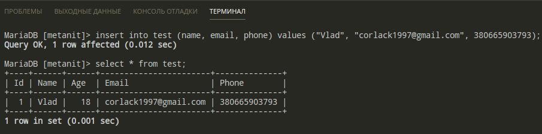

# Атрибуты, внешние ключи, изменение таблиц и столбов

## Атрибуты столбцов и таблиц

* ### `AUTO_INCREMENT`

    Атрибут указывает, что значение столбца будет автоматически увеличиваться при добавлении новой строки. Работает для целых и чисел с плавающей точкой:

    ```sql
    CREATE TABLE test
    (
        # Значение id будет увеличиваться на 1
        Id INT PRIMARY KEY AUTO_INCREMENT, 
        Name VARCHAR(20),
        Age INT,
    );
    ```

    Можно выбрать значение с которого будет начинаться первоначальный отчёт `ID`:

    ```sql
    ALTER TABLE test AUTO_INCREMENT = 100;
    ```

* ### `UNIQUE`

    Атрибут указывает, что столбец может хранить только уникальные значения: 

    ```sql
    # 1) Создание таблицы с уникальным значением для столбца Phone
    CREATE TABLE test
    (
        Id INT PRIMARY KEY AUTO_INCREMENT, 
        Name VARCHAR(20),
        Age INT,
        Phone VARCHAR(13) UNIQUE
    );

    # 2) Попытка присвоить второму полю одинаковый номер из таблицы
    insert into test (name, age, phone) values ("Vlad", 23, +380665903793);

    insert into test (name, age, phone) values ("Max", 28, +380665903793);
    ERROR 1062 (23000): Duplicate entry '380665903793' for key 'Phone'
    ```

    Также можно определить атрибут на уровне таблицы: 

    ```sql
    CREATE TABLE test
    (
        Id INT PRIMARY KEY AUTO_INCREMENT,
        Name VARCHAR(20),
        Age INT,
        Email VARCHAR(30),
        Phone VARCHAR(20),
        UNIQUE(Email, Phone)
    );
    ```

* ### `NULL и NOT NULL`

    Чтобы указать, может ли столбец принимать значение `NULL`, при определении столбца ему можно задать атрибут `NULL` или `NOT NULL`. Если этот атрибут не будет использован, то по дефолту столбец будет допускать значение `NULL`. 
    
    Исключением является тот случай, когда столбец выступает в роли первичного ключа - в этом случае по умолчанию столбец имеет значение NOT NULL.

    ```sql
    CREATE TABLE test
    (
        Id INT PRIMARY KEY AUTO_INCREMENT, # по дефолту NOT NULL
        Name VARCHAR(20), # по дефолту NULL
        Age INT,
        Email VARCHAR(30) NOT NULL, # не допускается NULL
        Phone VARCHAR(20) NULL, # допускается NULL
    );
    ```

* ### `DEFAULT`

    Атрибут определяет значение по дефолту для столбца. Если при добавлении для столбца не будет никакого значения - то будет использовано значение по дефолту (как в функциях js):

    ```sql
    CREATE TABLE test
    (
        Id INT PRIMARY KEY AUTO_INCREMENT,
        Name VARCHAR(20),
        Age INT DEFAULT 18, # по дефолту 18
        Email VARCHAR(30),
        Phone VARCHAR(20),
    );
    ```

    Результат пропуска поля `Age`:

    

* ### `CHECK`

    Атрибут задаёт ограничение для диапазона значений, которые могут храниться в столбце:

    ```sql
    CREATE TABLE test
    (
        Id INT PRIMARY KEY AUTO_INCREMENT,
        Age INT DEFAULT 18 CHECK (Age > 0 AND Age < 100),
        Email VARCHAR(30) CHECK (Email != ""),
        Phone VARCHAR(20) CHECK (Phone != "")

        # Также можно использовать на уровне таблицы в самом конце: 
        CHECK((Age >0 AND Age<100) AND (Email !='') AND (Phone !=''))
    );
    ```

    Результат при несоблюдении одного из условий: 

    ```sql
    # Ошибка: аргумент email не подходит под условие CHECK
    INSERT INTO test (age, email, phone) values (23, "", "380665903793");
    ERROR 4025 (23000): CONSTRAINT `test.Email` failed for `metanit`.`test`

    # Ошибка: аргумент phone не подходит под условие CHECK
    INSERT INTO test (age, email, phone) values (23, "corlack1997@gmail.com", "");
    ERROR 4025 (23000): CONSTRAINT `test.Phone` failed for `metanit`.`test`

    # Все условия соблюдены и подходят под CHECK
    INSERT INTO test (age, email, phone) values (23, "corlack1997@gmail.com", "380665903793");
    Query OK, 1 row affected (0.017 sec)
    ```
***

## Внешние ключи FOREING KEY

