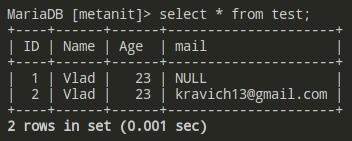

# Атрибуты, внешние ключи, изменение таблиц и столбов

## Атрибуты столбцов и таблиц

* ### `PRIMARY KEY`

    Значения `PRIMARY KEY` должны быть всегда **уникальны**, а так же не содержать значений `NULL`. Этот столбец нельзя **изменить** и **удалить**, он уникален.

    Любая таблица **обязана** иметь первичный ключ, по которому можно однозначно идентифицировать записи в ней.

    ```sql
    CREATE TABLE test
    ( 
      Id INT PRIMARY KEY,
      Name VARCHAR(20),
      Age INT  
    );

    # Установка ключа на уровне таблицы
    PRIMARY KEY (Id)
    ```


* ### `AUTO_INCREMENT`

    Атрибут указывает, что значение столбца будет автоматически увеличиваться при добавлении новой строки. Работает для целых и чисел с плавающей точкой:

    ```sql
    CREATE TABLE test
    (
        # Значение id будет увеличиваться на 1
        Id INT PRIMARY KEY AUTO_INCREMENT, 
        Name VARCHAR(20),
        Age INT,
    );
    ```

    Можно выбрать значение с которого будет начинаться первоначальный отчёт `ID`:

    ```sql
    ALTER TABLE test AUTO_INCREMENT = 100;
    ```

* ### `UNIQUE`

    Атрибут указывает, что столбец может хранить только уникальные значения: 

    ```sql
    # 1) Создание таблицы с уникальным значением для столбца Phone
    CREATE TABLE test
    (
        Id INT PRIMARY KEY AUTO_INCREMENT, 
        Name VARCHAR(20),
        Age INT,
        Phone VARCHAR(13) UNIQUE
    );    

    # 2) Попытка присвоить второму полю одинаковый номер из таблицы
    insert into test (name, age, phone) values ("Vlad", 23, +380665903793);

    insert into test (name, age, phone) values ("Max", 28, +380665903793);
    ERROR 1062 (23000): Duplicate entry '380665903793' for key 'Phone'
    ```

    Также можно определить атрибут на уровне таблицы: 

    ```sql
    CREATE TABLE test
    (
        Id INT PRIMARY KEY AUTO_INCREMENT,
        Name VARCHAR(20),
        Age INT,
        Email VARCHAR(30),
        Phone VARCHAR(20),
        UNIQUE(Email, Phone)
    );
    ```

* ### `NULL и NOT NULL`

    Чтобы указать, может ли столбец принимать значение `NULL`, при определении столбца ему можно задать атрибут `NULL` или `NOT NULL`. Если этот атрибут не будет использован, то по дефолту столбец будет допускать значение `NULL`. 
    
    Исключением является тот случай, когда столбец выступает в роли первичного ключа - в этом случае по умолчанию столбец имеет значение NOT NULL.

    ```sql
    CREATE TABLE test
    (
        Id INT PRIMARY KEY AUTO_INCREMENT, # по дефолту NOT NULL
        Name VARCHAR(20), # по дефолту NULL
        Age INT,
        Email VARCHAR(30) NOT NULL, # не допускается NULL
        Phone VARCHAR(20) NULL, # допускается NULL
    );
    ```

* ### `DEFAULT`

    Атрибут определяет значение по дефолту для столбца. Если при добавлении для столбца не будет никакого значения - то будет использовано значение по дефолту (как в функциях js):

    ```sql
    CREATE TABLE test
    (
        Id INT PRIMARY KEY AUTO_INCREMENT,
        Name VARCHAR(20),
        Age INT DEFAULT 18, # по дефолту 18
        Email VARCHAR(30),
        Phone VARCHAR(20),
    );
    ```

    Результат пропуска поля `Age`:

    

* ### `CHECK`

    Атрибут задаёт ограничение для диапазона значений, которые могут храниться в столбце:

    ```sql
    CREATE TABLE test
    (
        Id INT PRIMARY KEY AUTO_INCREMENT,
        Age INT DEFAULT 18 CHECK (Age > 0 AND Age < 100),
        Email VARCHAR(30) CHECK (Email != ""),
        Phone VARCHAR(20) CHECK (Phone != "")

        # Также можно использовать на уровне таблицы в самом конце: 
        CHECK((Age >0 AND Age<100) AND (Email !='') AND (Phone !=''))
    );
    ```

    Результат при несоблюдении одного из условий: 

    ```sql
    # Ошибка: аргумент email не подходит под условие CHECK
    INSERT INTO test (age, email, phone) values (23, "", "380665903793");
    ERROR 4025 (23000): CONSTRAINT `test.Email` failed for `metanit`.`test`

    # Ошибка: аргумент phone не подходит под условие CHECK
    INSERT INTO test (age, email, phone) values (23, "corlack1997@gmail.com", "");
    ERROR 4025 (23000): CONSTRAINT `test.Phone` failed for `metanit`.`test`

    # Все условия соблюдены и подходят под CHECK
    INSERT INTO test (age, email, phone) values (23, "corlack1997@gmail.com", "380665903793");
    Query OK, 1 row affected (0.017 sec)
    ```
***

## Внешние ключи FOREIGN KEY

Внешние ключи позволяют установить связи между таблицами. Внешний ключ устанавливается для столбцов из зависимой, подчиненной таблицы, и указывает на один из столбцов из главной таблицы (одним словом - `prototype`). Как правило, внешний ключ указывает на первичный ключ из связанной главной таблицы.

Связывание двух таблиц, `Country` и `Cities` посредством внешнего ключа:

```sql
CREATE TABLE Country
(
    Id INT PRIMARY KEY AUTO_INCREMENT,
    Country VARCHAR(20) NOT NULL
);

CREATE TABLE Cities
(
    Id INT PRIMARY KEY AUTO_INCREMENT,
    City VARCHAR(30) NOT NULL,
    ID_Country INT,
    FOREIGN KEY (ID_Country)  REFERENCES Country (Id)
);
```

Здесь связаны таблицы Страны и Города. `ID_Country` в таблице `Cities` соответствует `Id` из таблицы `Country`.

### **ON DELETE и ON UPDATE:**

С помощью этих двух выражений ( **пишутся в самом конце до `);`** ) можно установить действия, которые выполняются при удалении и изменении связанной строки из главной таблицы.

Действия используют следующие методы: 

* `CASCADE` - автоматически удаляет или изменяет строки из зависимой таблицы при удалении или изменении связанных строк в главной таблице.

* `SET NULL` - при удалении или обновлении связанной строки из главной таблицы устанавливает для столбца внешнего ключа значение `NULL` (в этом случае столбец внешнего ключа должен поддерживать установку `NULL`).
* `RESTRICT` - отклоняет удаление или изменение строк в главной таблице при наличии связанных строк в зависимой таблице.
* `NO ACTION` - тоже самое, что `RESTRICT`.
* `SET DEFAULT` - при удалении связанной строки из главной таблицы устанавливает для столбца внешнего ключа значение по дефолту.

Пример удаления строк из внешней таблицы при удалении строки из главной: 

```sql
CREATE TABLE Country
(
    Id INT PRIMARY KEY AUTO_INCREMENT,
    Country VARCHAR(20) NOT NULL
);

CREATE TABLE Cities
(
    Id INT PRIMARY KEY AUTO_INCREMENT,
    City VARCHAR(30) NOT NULL,
    ID_Country INT,
    FOREIGN KEY (ID_Country)  REFERENCES Country (Id)
    ON DELETE CASCADE 
);
```
***

## Изменение таблиц и столбцов

### **Добавление нового столбца:**

```sql
# 1) Добавили новый столб mail в существующую таблицу test
ALTER TABLE test
ADD Mail VARCHAR(50) NULL;

# 2) Добавили новые данные с учётом нового столба
INSERT INTO test (name, age, mail) 
values ("Vlad", 23, "kravich13@gmail.com");
```

Теперь у первичных данных в новом столбце mail будет NULL:



### **Удаление столбца:**

При удалении всего столбца все данные из него удаляются:

```sql
ALTER TABLE test
DROP COLUMN mail;
```

### **Изменение значения по умолчанию:**

Даже если значение по дефолту не было установлено - оно будет установлено:

```sql
ALTER TABLE test
ALTER COLUMN Age SET DEFAULT 22;
```

### **Изменение типа столбца:**

```sql
ALTER TABLE test
MODIFY COLUMN FirstName CHAR(100) NULL;
```

### **Добавление внешнего ключа:**

Есть две абсолютно не связанные таблицы: 

```sql
CREATE TABLE Country
(
    Id INT PRIMARY KEY AUTO_INCREMENT,
    Country VARCHAR(20) NOT NULL
);

CREATE TABLE Cities
(
    Id INT PRIMARY KEY AUTO_INCREMENT,
    City VARCHAR(30) NOT NULL,
    ID_Country INT
);
```

Добавим ограничение внешнего ключа к столбцу `ID_Country` таблицы `Cities`:

```sql
ALTER TABLE Cities
ADD FOREIGN KEY(ID_Country) REFERENCES Country(Id);
```

### **Добавление и удаление первичного ключа:**

Добавим в таблицу `Products` первичный ключ: 

```sql
CREATE TABLE Products 
( 
    Id INT, 
    Model VARCHAR(30)
);

# Добавили первичный ключ
ALTER TABLE Products 
ADD PRIMARY KEY (Id);
```

Удаление первичного ключа: 

```sql
ALTER TABLE Products
DROP PRIMARY KEY;
```
