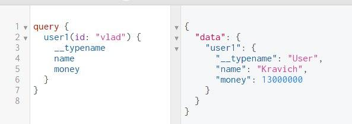

# GraphQL: алиасы, фрагменты, переменные, директивы и мета-поля

## Алиасы

Алиасы позволяют сделать двойной запрос. Поскольку в `JSON` нельзя писать одинаковые `key`, то Алиасы решают эту проблему.

```js
const schema = buildSchema(`
  type User {
    id: String
    name: String
    money: Int
    crypto: [String]
  }
 
  type Query {
    users(id: String): User
  }
`)

const fakeDatabase = {
  'vlad': {
    id: 'a',
    crypto: ["eth", "etc", "neo"]
  },
  'max': {
    id: 'b',
    name: 'Max',
    money: 40000000,
    crypto: ["btc", "eos", "iota"]
  },
}

const root = {
  users: ({ id }) => {
    return fakeDatabase[id]
  }
}
```

Есть два юзера и есть метод `users` с указанием `id`, с помощью Алиаса можно просто добавить подсвойство и таким образом будет выполнено два запроса в одном:


И это же свойство `test` является **названием** запроса, т.е. так можно делать для любого запроса и можно распознавать, что это именно за запрос.
***

## Фрагменты

**Фрагменты** - это как функции. Вместо того, чтобы писать много раз один и тот же код - достаточно написать **фрагмент** один раз и вызвать его как функцию в нужном месте.


Есть следующий код:

```js
// 1) Определение схемы с выводом двух одинаковых юзеров из БД
const schema = buildSchema(`
  type User {
    id: String
    name: String
    money: Int
    crypto: [String]
  }
 
  type Query {
    user1(id: String): User
    user2(id: String): User
  }
`)
 
// 2) Определение каждого юзера из БД
const fakeDatabase = {
  'vlad': {
    id: 'a',
    name: 'Kravich',
    money: 13000000,
    crypto: ["eth", "etc", "neo"]
  },
  'max': {
    id: 'b',
    name: 'Max',
    money: 40000000,
    crypto: ["btc", "eos", "iota"]
  },
}

// 3) Определение объекта под схему
const root = {
  user1: ({ id }) => {
    return fakeDatabase[id]
  },
  user2: ({ id }) => {
    return fakeDatabase[id]
  }
}
```

Теперь выведем двух юзеров в **GraphiQL** и посмотрим на код из запроса:

```bash
# Каждый запрос имеет по 4 одинаковых поля в запросе, это занимает много места и не имеет смысла.
query {
    user1(id: "vlad") {
	    id
	    name
        money
        crypto
    }
    user2(id: "max") {
	    id
	    name
        money
        crypto
	}
}
```

Вместо такого "копипаста" можно использовать `fragment`, в который передаются те параметры, которые будут дублироваться. И если нужно вызвать доп. параметр без фрагмента - то можно так сделать: **до** или **после** вызова дописать нужное поле:


### ***Встроенные фрагменты:***

Также фрагменты могут быстро встроенными, пригодиться может в разных случаях:


***


## Переменные

В **GraphQL** есть переменные, которые можно подставлять в запрос и не делать новый запрос с новым значением, а просто изменить переменную и вызвать другие данные.

Код взят из примера выше, но уже на **переменных**:


Как видно из скрина, сначала нужно: 

1) **Объявить** переменную в `QUERY VARIABLES` в виде `JSON` объекта;
2) **Определить** переменную после `query` в функции `yourName` (`test` в примере), после чего в её параметре определить переменную и указать тип данных в этой переменной.
3) **Вызвать** переменную в вызове функции через `$` и получить запрос.

Тоже самое делается и через клиентский запрос JS:

```js
run()
async function run() {

  // Переменная
  let id = "max"

  // 1) Определение переменной в функции test с типом String
  // 2) Вызов переменной в вызове функции user1
  const query = `query test($id: String!) {
    user1 (id: $id) {
      crypto
    }
  }`

  const res = await fetch('/graphql', {
      method: 'POST',
      headers: {
        'Content-Type': 'application/json',
        'Accept': 'application/json',
      },
      body: JSON.stringify({
        query,
        // 3) Передача переменной в качестве переменной для variables
        variables: { id },
      })
    })
  
  const result = await res.json()
  console.log(result)
}
```
***

## Директивы

Директива динамически скрывает или показывает нужные поля. Работает также, как и `if (boolean)` в JS. Т.е. если true - срабатывает, иначе - нет.

Пример `app.js` как и выше:


Т.е., если значение переменной `true` - будет **показано** поле или вложенное поле (можно вложить после круглых скобок). Если `false` - поле будет **скрыто**.


* `@include(if: Boolean)` - только включает это поле в результат, если аргумент имеет значение `true`.
* `@skip(if: Boolean)` - пропускает это поле, если аргумент имеет значение `true`.


Как видно из скрина, переменная крипто `true` и все её вложенные значения показываются. А вот у переменной `money` значение `false` и поле `money` скрыто.
***

## Мета-поля

**GraphQL** позволяет запросить `__typename`, мета-поле, в любой точке запроса, чтобы получить имя типа объекта в этой точке:


