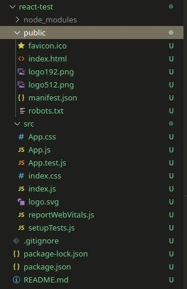

# React: основы, хуки, условный рендеринг

## Основы React

### **_Установка и запуск:_**

Для установки реакта требуется проверить наличие `npx`, для этого проверяем в терминале:

```bash
npx -v
```

Для установки `React` в папку требуется перейти в папку, открыть в ней терминал и ввести следующее:

```bash
# react-test - название папки, в которой будет лежать всё react приложение
npx create-react-app react-test
```

При создании папки `react-test` структура папок будет следующая:



- **`public`**

  В ней находится файл `index.html`, в котором есть `HTML` тег `<div id="root"></div>`, который и отвечает за всю отрисовку сайта. Т.е. если в `DOM` вся отрисовка происходит на уровне `document.body`, то в реакте в этот `div id=root`.

- **`src`**

  В ней находится самый важный `JS` файл - `index.js`, из которого запускается весь `React` код. Строка:

  ```js
  // ReactDOM рендерит файл App.js (весь реакт код) в этот div id=root
  ReactDOM.render(<App /> document.getElementById('root'))
  ```

  Тег `<App />` - это файл `App.js`, в котором будет писаться вся структура приложения.

  Можно удалить:

  - `App.test.js`
  - `logo.svg`
  - `reportWebVitals.js`
  - `setupTests.js`

**Для запуска приложения** вводим команду `npm start`, после которой перекинет на адрес `localhost:3000` и на нём будет отображён весь контент из файла `App.js`.

---

### **_Компоненты:_**

Компоненты - это `JSX` файлы реакта, в которых пишется отдельный функционал и после он экспортируется в файл `App.js`. Суть та же, что и подключение `script` в `HTML` для удобной работы и чистоты кода.

Создадим папку `Todo`, в которой создадим файл `TestTodo.js`. В него поместим следующий код:

```jsx
// Импортировали React
import React from 'react'

// Экспортировали JSX компонент
export default function TestTodo() {
  return (
    <ul>
      <li>Текст1</li>
      <li>Текст2</li>
      <li>Текст3</li>
    </ul>
  )
}
```

Для подключения компонента его нужно подключить к `App.js`:

```jsx
import React from 'react'
import './App.css'
// Подключаем JSX компонент
import TestTodo from './Todo/TestTodo'

function App() {
  return (
    <div className="App">
      <h1>Привет ещё раз.</h1>
      <p>Спустя 1 год я взялся за реакт</p>

      <TestTodo />
    </div>
    // Подключенный компонент, в котором лежит HTML код из ul и li
  )
}

export default App
```

Также к этим компонентам можно встраивать другие компоненты, и таким образом выйдет цепочка из компонентов.

---

### **_Стили:_**

**Любой `JS` код подключается в `JSX` через `{}`.**

Для подключения стилей к элементу без создания `ID` применяется объект `styles` в компоненте или `App.js`:

```jsx
// TestTodo.js
import React from 'react'
import TodoItem from './TodoItem'

// 1) создаём объект styles и прописываем туда стили, как в DOM
const styles = {
  ul: {
    listStyle: 'none',
    margin: 0,
    marginLeft: '20px',
    padding: '3px',
    color: 'red',
    background: 'lightGrey',
    width: '300px',
    border: '1px solid black',
    borderRadius: '5px'
  }
}

export default function TestTodo(objMess) {
  return (
    // 2) и этот объект подключаем через атрибут style
    <ul style={styles.ul}>
      {objMess.messages.map((message) => {
        console.log(message.id)
        return <TodoItem message={message} key={message.id} />
      })}
    </ul>
  )
}
```

Таким образом, все стили из объекта `styles` по key `ul` будут подключены к конкретному элементу `ul`. Объект со стилями можно делать для многих элементов и это сильно упрощает взаимодействие с `DOM` стилями.

Также для подключения общих `css` стилей нужно импортировать `.css` в `JSX`:

```jsx
import './App.css'
```

---

### **_Параметры в компонент и циклы:_**

Подключённый компонент сам по себе не обладает никакой функциональностью, но ему можно передать параметры и использовать в его файле по назначению:

```jsx
// App.js

function App() {
  let i = 1
  const messages = [
    { id: i++, completed: false, title: 'Привет' },
    { id: i++, completed: false, title: 'ну даров' },
    { id: i++, completed: false, title: 'хай' },
    { id: i++, completed: false, title: 'кравич?' },
    { id: i++, completed: false, title: 'да' }
  ]

  return (
    <div className="App">
      <h1>Привет ещё раз.</h1>
      <p>Спустя 1 год я взялся за реакт</p>

      <TestTodo messages={messages} />
    </div>
    // В компонент передаю параметр messages с одноимённым массивом
    // подключение через { код JS }
  )
}
```

Для **каждого** итерируемого **объекта** в реакте требуется добавить атрибут `key` с переданным **уникальным** значением. Этим `key` может быть стока, которая находится в элементе массива: `message.toString()` или что-то ещё.

Также `key` должны быть уникальны только в своей области видимости, т.е. в каждом `ul` может быть сколько угодно `li` с одинаковыми названия `key`. **Уникальность** должна быть **только внутри родительского элемента**.

Теперь выводим в цикле переданный массив объектов:

```jsx
// TestTodo.js

export default function TestTodo(objMess) {
  return (
    // objMess - объект, в котором есть массив messages
    // objMess.messages - обращение к самому массиву объектов
    // по массиву делаем итерацию и возвращаем другой компонент с переданными в него параметрами цикле
    <ul style={styles.ul}>
      {objMess.messages.map((message) => {
        console.log(message.id)
        return <TodoItem message={message} key={message.id} />
      })}
    </ul>
  )
}
```

```jsx
// TodoItem.js

export default function TodoItem({ message }) {
  // объект message
  return <li>{`[${message.id}]: ${message.title}`}</li>
}
```

Когда нет заданных `ID` для списка, то в крайнем случае можно использовать `индекс` элемента массива как ключ (второй параметр `map` - `index`). Но использовать такой метод стоит **только** в том случае, если порядок элементов меняться не будет.

---

### **_События:_**

При использовании `React` обычно не нужно вызывать `addEventListener`, чтобы добавить обработчики в DOM-элемент после его создания. Вместо этого **ивенты** добавляются ровно также, как и `HTML` через `on`, к примеру событие `onClick={код JS}`:

```jsx
// TodoItem.js

export default function TodoItem({ message }) {
  function clickStylesLi(event) {
    const et = event.target

    et.classList.toggle('clickLi')
  }

  return (
    <li className="testLi" onClick={clickStylesLi}>
      {`[${message.id}]: ${message.title}`}
    </li>
  )
}
```

Теперь при клике на конкретный элемент `li` будет применён класс со стилями.
---

## Условный рендеринг

Часто требуется замена элемента при условии `if`, для этого можно использовать всё те же атрибуты у элементов с передачей нужных параметров.

Для примера есть код, который симулирует компоненты, которые подключаются в `JSX` по условию:

```jsx
// App.js
function App() {
  // 1) Функция, которая вызывается от передачи параметра в компонент
  // которая подключает тот или иной компонент
  function Greeting(props) {
    const isLoggedIn = props.isLoggedIn
    if (isLoggedIn) {
      return <UserGreeting />
    }
    return <GuestGreeting />
  }

  // 2) Компонент, который включается, если пользователь авторизирован
  function UserGreeting() {
    return (
      <div>
        <h2>Блок с сообщениями:</h2>
        <p>
          Четверг <span>[1]: Привет</span>
        </p>
        <p>
          Четверг <span>[2]: Привет</span>
        </p>
      </div>
    )
  }

  // 3) Компонент, который будет по дефолту, если юзер отключён
  function GuestGreeting() {
    return (
      <div>
        <p>Вы не авторизировались!</p>
      </div>
    )
  }
  return (
    <div className="App">
      <h1>Привет раз.</h1>
      <p>Спустя 1 год я взялся за реакт</p>

      <Greeting isLoggedIn={true} />
    </div>
    // В этот компонент записываем условие
  )
}
```

### **_Встроенные условия `if` с оператором &&:_**

Можно внедрить любое выражение `JSX` заключив его в `{ }`. Например, с помощью `&&` можно вставлять элемент (или компонент) в зависимости от условия:

```jsx
function App() {
  // Массив с сообщениями
  const messages = ['заработал 13 битков?', 'эй ты']

  function MailBox(objArr) {
    const arrMessage = objArr.myMessages

    return (
      // Если массив больше 0, то true и делаем отрисовку компонента
      // а если false - то никакой отрисовки не будет
      <div>
        <h3>Здравствуйте</h3>
        {arrMessage.length > 0 && (
          <p>У вас {arrMessage.length} непрочитанных сообщений</p>
        )}
      </div>
    )
  }
  return (
    //  Встраиваем подобие компонента с параметром "моиСообщения" и их массивом
    <div className="App">
      <MailBox myMessages={messages} />
    </div>
  )
}
```

Важно отметить, что:

- **после** `&&` при условии `false` код выведен не будет.
- **до** `&&` код будет выведен независимо от `true/false`

### **_Встроенные условие с тренарным оператором:_**

Ещё один способ писать условия прямо в `JSX` - использовать тренарный оператор: `messages ? true : false`.

```jsx
function App() {
  let flag = true

  return (
    <div className="App">
      <p>
        Пользователь{' '}
        <b style={{ color: 'grey' }}>{flag ? 'в сети' : 'не в сети'}</b>
      </p>
    </div>
  )
}
```

### **_Предотвражение рендеринга компонента:_**

Очень часто нужно сделать выдвигающееся меню, для этого элемент нужно показать по нажатию и скрыть по нажатию ещё раз. Для того, чтобы не рендерить компонент - нужно сделать `return null` и компонент будет скрыт:

```jsx
function App() {
  // 1) определение флага хуком useState для его изменения
  const [flag, setFlag] = useState(() => false)

  // 2) в зависимости от флага показывает или скрываем меню
  function MenuClick(objFlag) {
    if (!objFlag.flag) return null

    return <div>1 лист...</div>
  }

  // 3) при клике на button меняем флаг на противоположный
  // и тем самым происходит рендер
  function clickButton() {
    setFlag(!flag)
  }

  return (
    <div className="App">
      <button onClick={() => clickButton(flag)}>
        {flag ? 'Скрыть' : 'Показать'} меню
      </button>

      <MenuClick flag={flag} />
    </div>
  )
}
```

---

## Формы

Для работы с формами применяются ровно те же методы с хуком `useState`. Например, нужно вывести/отправить введенное **имя** из инпута после данных формы:

```jsx
function App() {
  // 1) создаём хук с пустой строкой (якобы введенная юзером)
  const [userName, setUserName] = useState(() => '')

  // 2) при введении данных в инпут - строка перезаписывается в хук
  function handleChange(event) {
    setUserName(event.target.value)
  }

  // 3) при отправлении данных срабатывает алерт с введенным именем юзера
  function handleSubmit(event) {
    event.preventDefault()
    alert(`Отправленное имя: ${userName}`)
  }

  return (
    <div className="App">
      <form onSubmit={handleSubmit}>
        <label>
          Введите имя:
          <input
            onChange={handleChange}
            type="text"
            name="userName"
            placeholder="Kravich"
          />
        </label>
        <button>Отправить</button>
      </form>
    </div>
  )
}
```

Таким образом можно передать последние введенные данные из `input` и по клику на кнопку получить финальнуые введенные данные.


