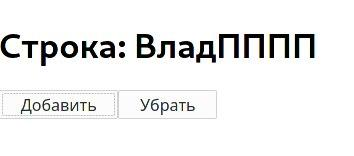

# React: основы, хуки, условный рендеринг

## Основы React

### ***Установка и запуск:***

Для установки реакта требуется проверить наличие `npx`, для этого проверяем в терминале:

```bash
npx -v 
```

Для установки `React` в папку требуется перейти в папку, открыть в ней терминал и ввести следующее:

```bash
# react-test - название папки, в которой будет лежать всё react приложение
npx create-react-app react-test
```

При создании папки `react-test` структура папок будет следующая:


* **`public`**

    В ней находится файл `index.html`, в котором есть `HTML` тег `<div id="root"></div>`, который и отвечает за всю отрисовку сайта. Т.е. если в `DOM` вся отрисовка происходит на уровне `document.body`, то в реакте в этот `div id=root`.

    
* **`src`**

    В ней находится самый важный `JS` файл - `index.js`, из которого запускается весь `React` код. Строка: 

    ```js
    // ReactDOM рендерит файл App.js (весь реакт код) в этот div id=root
    ReactDOM.render(<App /> document.getElementById('root'))
    ```

    Тег `<App />` - это файл `App.js`, в котором будет писаться вся структура приложения.

    Можно удалить:
    * `App.test.js`
    * `logo.svg`
    * `reportWebVitals.js`
    * `setupTests.js` 

**Для запуска приложения** вводим команду `npm start`, после которой перекинет на адрес `localhost:3000` и на нём будет отображён весь контент из файла `App.js`.
***

### ***Компоненты:***

Компоненты - это `JSX` файлы реакта, в которых пишется отдельный функционал и после он экспортируется в файл `App.js`. Суть та же, что и подключение `script` в `HTML` для удобной работы и чистоты кода.

Создадим папку `Todo`, в которой создадим файл `TestTodo.js`. В него поместим следующий код: 

```jsx
// Импортировали React
import React from  "react"

// Экспортировали JSX компонент 
export default function TestTodo () {
    return (
        <ul>
            <li>Текст1</li>
            <li>Текст2</li>
            <li>Текст3</li>
        </ul>
    )
}
```

Для подключения компонента его нужно подключить к `App.js`:

```jsx
import React from "react"
import "./App.css"
// Подключаем JSX компонент
import TestTodo from "./Todo/TestTodo"

function App () {
    return (
        <div className="App">
            <h1>Привет ещё раз.</h1>
            <p>Спустя 1 год я взялся за реакт</p>
    
            <TestTodo />
        </div>
    // Подключенный компонент, в котором лежит HTML код из ul и li
    )
}

export default App
```

Также к этим компонентам можно встраивать другие компоненты, и таким образом выйдет цепочка из компонентов.
***

### ***Стили:***

**Любой `JS` код подключается в `JSX` через `{}`.**

Для подключения стилей к элементу без создания `ID` применяется объект `styles` в компоненте или `App.js`:

```jsx
// TestTodo.js
import React from  "react"
import TodoItem from "./TodoItem"

// 1) создаём объект styles и прописываем туда стили, как в DOM
const styles = {
    ul: {
        listStyle: "none",
        margin: 0,
        marginLeft: "20px",
        padding: "3px",
        color: "red",
        background: "lightGrey",
        width: "300px",
        border: "1px solid black",
        borderRadius: "5px"
    }
}

export default function TestTodo (objMess) {
    return (
        // 2) и этот объект подключаем через атрибут style
        <ul style={styles.ul}>
            { objMess.messages.map(message => {
                console.log(message.id)
                return <TodoItem message={message} key={message.id} />   
            }) }
        </ul>
    )
}
```

Таким образом, все стили из объекта `styles` по key `ul` будут подключены к конкретному элементу `ul`. Объект со стилями можно делать для многих элементов и это сильно упрощает взаимодействие с `DOM` стилями.

Также для подключения общих `css` стилей нужно импортировать `.css` в `JSX`:

```jsx
import "./App.css"
```
***
### ***Параметры в компонент и циклы:***

Подключённый компонент сам по себе не обладает никакой функциональностью, но ему можно передать параметры и использовать в его файле по назначению:

```jsx
// App.js

function App () {

    let i = 1
    const messages = [
        { id: i++, completed: false, title: "Привет"  },
        { id: i++, completed: false, title: "ну даров"  },
        { id: i++, completed: false, title: "хай"  },
        { id: i++, completed: false, title: "кравич?"  },
        { id: i++, completed: false, title: "да"  }
    ]

    return (
        <div className="App">
            <h1>Привет ещё раз.</h1>
            <p>Спустя 1 год я взялся за реакт</p>
    
            <TestTodo messages={messages}/>
        </div>
        // В компонент передаю параметр messages с одноимённым массивом
        // подключение через { код JS } 
    )
}
```

Для **каждого** итерируемого **объекта** в реакте требуется добавить атрибут `key` с переданным **уникальным** значением. Этим `key` может быть стока, которая находится в элементе массива: `message.toString()` или что-то ещё. 

Также `key` должны быть уникальны только в своей области видимости, т.е. в каждом `ul` может быть сколько угодно `li` с одинаковыми названия `key`. **Уникальность** должна быть **только внутри родительского элемента**.

Теперь выводим в цикле переданный массив объектов:

```jsx
// TestTodo.js

export default function TestTodo (objMess) {
    return (
        // objMess - объект, в котором есть массив messages
        // objMess.messages - обращение к самому массиву объектов
        // по массиву делаем итерацию и возвращаем другой компонент с переданными в него параметрами цикле
        <ul style={styles.ul}>

            { objMess.messages.map(message => {
                console.log(message.id)
                return <TodoItem message={message} key={message.id} />   
            }) }

        </ul>
    )
}
```
```jsx
// TodoItem.js

export default function TodoItem ({ message }) {
    // объект message
    return <li>{`[${message.id}]: ${message.title}`}</li>
}
```

Когда нет заданных `ID` для списка, то в крайнем случае можно использовать `индекс` элемента массива как ключ (второй параметр `map` - `index`). Но использовать такой метод стоит **только** в том случае, если порядок элементов меняться не будет.
***


### ***События:***

При использовании `React` обычно не нужно вызывать `addEventListener`, чтобы добавить обработчики в DOM-элемент после его создания. Вместо этого **ивенты** добавляются ровно также, как и `HTML` через `on`, к примеру событие `onClick={код JS}`:

```jsx
// TodoItem.js

export default function TodoItem ({ message }) {

    function clickStylesLi (event) {
        const et = event.target

        et.classList.toggle("clickLi")
    }

    return (
        <li 
        className="testLi"
        onClick={clickStylesLi}
        >
            {`[${message.id}]: ${message.title}`}
        </li>
    )
}
```

Теперь при клике на конкретный элемент `li` будет применён класс со стилями.
***

## Хуки


### ***Хук useState:***
Есть пример с увеличением и уменьшием счётчиков. Но, в `React` нельзя изменить элемент так, чтобы это изменение отобразилось на странице даже после ивента, например:

```jsx
function App () {

    let i = 0
    
    function increment () {
        ++i
        console.log(i)
        // в консоли видно, что при каждом клике счётчик меняет значение
        // но на само отображение (рендер) это никак не влияет
    }

    function decrement () { --i }

    return (
        <div className="App">
            <h1>Счётчик: {i}</h1>    
            <button onClick={increment}>Добавить</button>
            <button onClick={decrement}>Убрать</button>
        </div>
    )
}
```

По факту счётчик изменён, а вот в самом рендеринге он никак не изменяется, потому что рендеринг происходит **один** раз в статическом состоянии:


Для того, чтобы рендер происходил при каждом изменении счётчика или чего либо ещё - этот **изменяемый элемент** нужно поместить в **хук `useState`**, который по сути из себя представляет массив из двух элементов:

* `[0]` - является передаваемым элементом в `useState()`
* `[1]` - является функцией, которая позволяет изменять сам элемент и рендерить его изменение в `React`

```jsx
function App () {

    // Обязательно let, иначе ругается на const 
    let [counterI, setCounterI] = useState(0)
    
    function increment () { setCounterI(++counterI) } // работает плюс
    function decrement () { setCounterI(--counterI) } // работает минус

    return (
        <div className="App">
            <h1>Счётчик: {counterI}</h1>    
            <button onClick={increment}>Добавить</button>
            <button onClick={decrement}>Убрать</button>
        </div>
    )
}
```

Теперь при каждом нажатии на обе кнопки счётчик меняется и рендеринг происходит:


Также второй элемент `useState()` может возвращать **предыдущее** состояние, к которому можно добавить значение или всё также его изменить:

```jsx
function App () {
    let [counterStr, setCounterStr] = useState("Влад")

    function strPlus () { 
        setCounterStr( prev => `${prev}П` )
        // Функция возвращает предыдущее состояние..
        // ..таким образом к нему можно добавлять новые значения
    }

    // Или можно вернуть состояние в дефолт
    function strMinus () { setCounterStr( prev => prev = "Влад") }

    return (
        <div className="App">
            <h1>Строка: {counterStr}</h1>    
            <button onClick={strPlus}>Добавить</button>
            <button onClick={strMinus}>Убрать</button>
        </div>
    )
}
```
И как видим, теперь при нажатии на "добавить" будет добавляться один символ к "Влад". А если нажать на "убрать" - состояние вернётся в "Влад".




Также, если передавать какую-то функцию, которая должна **вызываться** лишь **один** раз внутри `useState()`, то нужно сделать её вызов через `cb` функцию:

```jsx
function randomState () {
    console.log("тут") 
    return Math.trunc(Math.random () * 13)
}

function App () {
    let [counterI, setCounterI] = useState( () => {
        // Теперь при любом изменении рендеринга функция randomState будет вызвана лишь один раз при загрузке страницы
        return randomState()
    })
    
    function increment () { setCounterI(++counterI) } // работает плюс
    function decrement () { setCounterI(--counterI) } // работает минус

    return (
        <div className="App">
            <h1>Строка: {counterI}</h1>    
            <button onClick={increment}>Добавить</button>
            <button onClick={decrement}>Убрать</button>
        </div>
    )
}
```
***

### ***Хук useEffect:***

Этот хук нужен для того, чтобы отслеживать изменения глобально или внутри отдельных компонентах/переменных:

```jsx
function App () {
    const [type, setType] = useState("users")
    
    // 1) Вызывается всегда, при любом нажатии/событии
    console.log("рендер компонента")

    useEffect( () => {
        // 2) Вызывается всегда при рендере любого компонента
        console.log("рендер эффекта")
    })

    useEffect( () => {
        // 3) Отслеживание изменения конкретного компонента 
        console.log("Тип изменён", type)
    }, [type])

    return (
        <div className="App">

            <h1>Ресурс: {type}</h1>

            <button onClick={ () => setType("users")}>Пользователи</button>
            <button onClick={ () => setType("todo")}>Todo</button>
            <button onClick={ () => setType("posts")}>Посты</button>
        </div>
    )
}
```

Если кликать на одну и ту же кнопку **несколько** раз - то консоль лог будет срабатывать лишь в `1)` случае, а во всех остальных сработает лишь тогда, когда конкретный компонент/переменная в массиве **изменится**. 

Если компонент/переменная неизменны - `useEffect` вызван не будет. Это может пригодиться в том случае, если пришло новое сообщение в переменную и нужно его отрисовать.
***
## Условный рендеринг

Часто требуется замена элемента при условии `if`, для этого можно использовать всё те же атрибуты у элементов с передачей нужных параметров.

Для примера есть код, который симулирует компоненты, которые подключаются в `JSX` по условию:

```jsx
// App.js
function App () {

    // 1) Функция, которая вызывается от передачи параметра в компонент
    // которая подключает тот или иной компонент
    function Greeting (props) {
        const isLoggedIn = props.isLoggedIn
        if (isLoggedIn) {
            return <UserGreeting />
        }
        return <GuestGreeting />
    }

    // 2) Компонент, который включается, если пользователь авторизирован
    function UserGreeting ()  {
        return (
            <div>
                <h2>Блок с сообщениями:</h2>
                <p>Четверг <span>[1]: Привет</span></p>
                <p>Четверг <span>[2]: Привет</span></p>
            </div>
        )
    }

    // 3) Компонент, который будет по дефолту, если юзер отключён
    function GuestGreeting () {
        return (
            <div><p>Вы не авторизировались!</p></div>
        )
    }
    return (
        <div className="App">
            <h1>Привет раз.</h1>
            <p>Спустя 1 год я взялся за реакт</p>

            <Greeting isLoggedIn={true} />   
        </div>
        // В этот компонент записываем условие
    )
}
```

### ***Встроенные условия `if` с оператором &&:***

Можно внедрить любое выражение `JSX` заключив его в `{ }`. Например, с помощью `&&` можно вставлять элемент (или компонент) в зависимости от условия:

```jsx
function App () {
    // Массив с сообщениями
    const messages = ["заработал 13 битков?", "эй ты"]

    function MailBox (objArr)  {
        const arrMessage = objArr.myMessages

        return (
            // Если массив больше 0, то true и делаем отрисовку компонента
            // а если false - то никакой отрисовки не будет
            <div>
                <h3>Здравствуйте</h3>
                { arrMessage.length > 0 &&
                    <p>
                        У вас {arrMessage.length} непрочитанных сообщений
                    </p>
                }   
            </div>
        )
    }
    return (
        //  Встраиваем подобие компонента с параметром "моиСообщения" и их массивом
        <div className="App">
            <MailBox myMessages={messages} />
        </div>
    )
}
```

Важно отметить, что:
* **после** `&&` при условии `false` код выведен не будет.
* **до** `&&` код будет выведен независимо от `true/false`

### ***Встроенные условие с тренарным оператором:***

Ещё один способ писать условия прямо в `JSX` - использовать тренарный оператор: `messages ? true : false`.

```jsx
function App () {

    let flag = true

    return (
        <div className="App">
            <p>
                Пользователь <b style={{color: "grey"}}>{flag ? "в сети" : "не в сети"}</b>
            </p>
        </div>
    )
}
```

### ***Предотвражение рендеринга компонента:***

Очень часто нужно сделать выдвигающееся меню, для этого элемент нужно показать по нажатию и скрыть по нажатию ещё раз. Для того, чтобы не рендерить компонент - нужно сделать `return null` и компонент будет скрыт:

```jsx
function App () {
    
    // 1) определение флага хуком useState для его изменения
    const [flag, setFlag] = useState( () => false)

    // 2) в зависимости от флага показывает или скрываем меню
    function MenuClick (objFlag) {
        if (!objFlag.flag) return null

        return (
            <div>1 лист...</div>
        )
    }

    // 3) при клике на button меняем флаг на противоположный 
    // и тем самым происходит рендер
    function clickButton () { setFlag(!flag) }

    return (
        <div className="App">

            <button onClick={() => clickButton(flag)}>
                {flag ? "Скрыть" : "Показать"} меню
            </button>

            <MenuClick flag={flag}/>
        </div>
    )
}
```
***

## Формы

Для работы с формами применяются ровно те же методы с хуком `useState`. Например, нужно вывести/отправить введенное **имя** из инпута после данных формы:

```jsx
function App () {
    // 1) создаём хук с пустой строкой (якобы введенная юзером)
    const [userName, setUserName] = useState( () => "")

    // 2) при введении данных в инпут - строка перезаписывается в хук
    function handleChange (event) {
        setUserName(event.target.value)
    }

    // 3) при отправлении данных срабатывает алерт с введенным именем юзера
    function handleSubmit (event) {
        event.preventDefault()
        alert(`Отправленное имя: ${userName}`)
    }

    return (
        <div className="App">
            <form onSubmit={handleSubmit}> 
               <label>
                Введите имя:
                <input onChange={handleChange}
                    type="text" 
                    name="userName" 
                    placeholder="Kravich" 
                />
               </label>
                <button>Отправить</button>
            </form>
        </div>
    )
}
```

Таким образом можно передать последние введенные данные из `input` и по клику на кнопку получить финальнуые введенные данные.