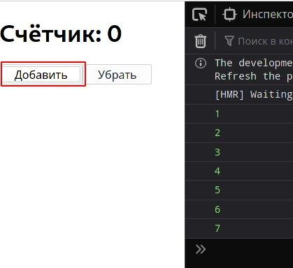
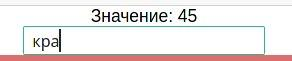

# React хуки: useState, useEffect, useContext

## Хук useState

Есть пример с увеличением и уменьшием счётчиков. Но, в `React` нельзя изменить элемент так, чтобы это изменение отобразилось на странице даже после ивента, например:

```jsx
function App() {
  let i = 0

  function increment() {
    ++i
    console.log(i)
    // в консоли видно, что при каждом клике счётчик меняет значение
    // но на само отображение (рендер) это никак не влияет
  }

  function decrement() {
    --i
  }

  return (
    <div className="App">
      <h1>Счётчик: {i}</h1>
      <button onClick={increment}>Добавить</button>
      <button onClick={decrement}>Убрать</button>
    </div>
  )
}
```

По факту счётчик изменён, а вот в самом рендеринге он никак не изменяется, потому что рендеринг происходит **один** раз в статическом состоянии:



Для того, чтобы рендер происходил при каждом изменении счётчика или чего либо ещё - этот **изменяемый элемент** нужно поместить в **хук `useState`**, который по сути из себя представляет массив из двух элементов:

- `[0]` - является передаваемым элементом в `useState()`
- `[1]` - является функцией, которая позволяет изменять сам элемент и рендерить его изменение в `React`

```jsx
function App() {
  // Обязательно let, иначе ругается на const
  let [counterI, setCounterI] = useState(0)

  function increment() {
    setCounterI(++counterI)
  } // работает плюс
  function decrement() {
    setCounterI(--counterI)
  } // работает минус

  return (
    <div className="App">
      <h1>Счётчик: {counterI}</h1>
      <button onClick={increment}>Добавить</button>
      <button onClick={decrement}>Убрать</button>
    </div>
  )
}
```

Теперь при каждом нажатии на обе кнопки счётчик меняется и рендеринг происходит:


Также второй элемент `useState()` может возвращать **предыдущее** состояние, к которому можно добавить значение или всё также его изменить:

```jsx
function App() {
  let [counterStr, setCounterStr] = useState('Влад')

  function strPlus() {
    setCounterStr((prev) => `${prev}П`)
    // Функция возвращает предыдущее состояние..
    // ..таким образом к нему можно добавлять новые значения
  }

  // Или можно вернуть состояние в дефолт
  function strMinus() {
    setCounterStr((prev) => (prev = 'Влад'))
  }

  return (
    <div className="App">
      <h1>Строка: {counterStr}</h1>
      <button onClick={strPlus}>Добавить</button>
      <button onClick={strMinus}>Убрать</button>
    </div>
  )
}
```

И как видим, теперь при нажатии на "добавить" будет добавляться один символ к "Влад". А если нажать на "убрать" - состояние вернётся в "Влад".


Также, если передавать какую-то функцию, которая должна **вызываться** лишь **один** раз внутри `useState()`, то нужно сделать её вызов через `cb` функцию:

```jsx
function randomState() {
  console.log('тут')
  return Math.trunc(Math.random() * 13)
}

function App() {
  let [counterI, setCounterI] = useState(() => {
    // Теперь при любом изменении рендеринга функция randomState будет вызвана лишь один раз при загрузке страницы
    return randomState()
  })

  function increment() {
    setCounterI(++counterI)
  } // работает плюс
  function decrement() {
    setCounterI(--counterI)
  } // работает минус

  return (
    <div className="App">
      <h1>Строка: {counterI}</h1>
      <button onClick={increment}>Добавить</button>
      <button onClick={decrement}>Убрать</button>
    </div>
  )
}
```

---

## Хук useEffect

Принимает `cb` функцию первым параметром, а вторым - массив из элементов для наблюдения.

Этот хук нужен для того, чтобы отслеживать изменения глобально или внутри отдельных компонентах/переменных **после рендера**:

```jsx
function App() {
  const [type, setType] = useState('users')

  // 1) Вызывается всегда, при любом нажатии/событии
  console.log('рендер компонента')

  useEffect(() => {
    // 2) Вызывается всегда при рендере любого компонента
    console.log('рендер эффекта')
  })

  useEffect(() => {
    // 3) Отслеживание изменения конкретного компонента
    console.log('Тип изменён', type)
  }, [type])

  return (
    <div className="App">
      <h1>Ресурс: {type}</h1>

      <button onClick={() => setType('users')}>Пользователи</button>
      <button onClick={() => setType('todo')}>Todo</button>
      <button onClick={() => setType('posts')}>Посты</button>
    </div>
  )
}
```

Если кликать на одну и ту же кнопку **несколько** раз - то консоль лог будет срабатывать лишь в `1)` случае, а во всех остальных сработает лишь тогда, когда конкретный компонент/переменная в массиве **изменится**.

Если компонент/переменная неизменны - `useEffect` вызван не будет. Это может пригодиться в том случае, если пришло новое сообщение в переменную и нужно его отрисовать.
***

## Хук useContext

`useContext` - это глобальный объект, который можно экспортировать как реакт и инпортировать в нужные компоненты, не прибегая к множеству вложенностей в компонентах. 

1) Для того, чтобы создать глобальный объект - нужно создать файл `context` в папке `src`:

    ```js
    import React from 'react'

    // 1) Создал глобальный объект контекст и экспортировал по дефолту
    const Context = React.createContext()
    export default Context
    ```

2) После этого его нужно импортировать в файле, в котором будет производиться логика и откуда нужно будет передать дальнейшие данные для работы:

    ```js
    import React from 'react'
    import './App.css'
    import Rooms from './all-blocks/Rooms'

    // 2) Импортировал контекст
    import Context from './context'

    function App() {

        function clickRoom(id, deleteTrue = false) {
            console.log('нажал в другом компоненте')
        }

        return (

            // 3) Обернул Context'ом тот элемент, в который необходимо передать нужный код
            // 4) Передаю необходимый код с помощью Props (функция клика на элемент закрытия)
            <Context.Provider value={{ clickRoom: clickRoom }}>
                <div className="App">
                    <Rooms />
                </div>
            </Context.Provider>
        )
    }
    export default App
    ```

3) Теперь можно получить контекст в файле, в котором он был необходим с самого начала:

    ```js
    // 5) Импортировал хук useContext и сам объект Context
    import React, { useState, useContext } from 'react'
    import Context from '../context'

    export default function Rooms() {
    
        const defaultList = [
            { id: 1, nameRoom: 'Общий чат', complited: false, deleteX: false },
            { id: 2, nameRoom: 'Maksym', complited: false, deleteX: false },
            { id: 3, nameRoom: 'Трейдинг', complited: false, deleteX: false },
            { id: 4, nameRoom: 'Vlad', complited: false, deleteX: false }
        ]

        const [rooms, setRooms] = useState(defaultList)

        function LiRoom(room) {

            // 6) Теперь сохраняю этот самый переданный контекст
            // Где хук useContext подключает твой переданный Context
            const { clickRoom } = useContext(Context)
            const elem = room.args

            return (
            <li className={classLi} >
                {elem.nameRoom}

                <!-- И теперь получается, что при клике на эту функцию из объекта clickRoom
                я перемещаюсь в главный компонент App, где срабатывает эта самая функция-->
                <p onClick={() => clickRoom(elem.id)} >
                    <span>&#10006;</span>
                </p>
            </li>
            )
        }

        return (
            <div>
            <ul>
                {rooms.map((room) => {
                return <LiRoom args={room} key={room.id} />
                })}
            </ul>
            </div>
        )
    }
    ```

Если описать коротко суть работы хука `useContext`, то выглядеть это будет так:

* Создаём файл с контекстом, подключаем Реакт, в объект с большой буквы сохраняем `React.createContext()` и экспортируем

* В компоненте, в котором нужно реализовать логику и передать контекст в другой компонет - подключаем этот самый объект `Context`, оборачиваем в компонент `Context.Provider` с передаваемыми параметрами тот компонент, в котором необходимо получить эти данные
* И затем в том самом файле, где необходимо получить контекст из главного файла - просто подключаем хук `useContext`, объект `Context` и получаем данные из него с помощью `useContext(context)`.
***

## Хук useRef

### ***Замена глобальным переменным:***

Например, стоит задача узнать, сколько рендеров было произведено на странице, как это сделать без глобальных переменных?

```js
function App() {
  const [countRender, setCountRender] = useState(0)

  useEffect(() => {
    setCountRender((prev) => prev + 1)
  })

  return (
    <div className="App">
      <p>Значение: {countRender}</p>
    </div>
  )
}
```

Вот так делать нельзя, потому что после рендера мы изменяем стейт, изменение стейта производит рендер и снова заходим в эффект, который изменяет стейт и так в вечном цикле.

Конечно, можно просто вынести переменную за пределы `function App`, но глобальная переменная за пределами компонента - не есть хорошо.

Тут и выручает хук `useRef`, который по сути является объектом со свойством `current`:

```js
function App() {

  const countRender = useRef(1)
  const [value, setValue] = useState('initial')

  useEffect(() => {
    console.log(countRender) // Object { current: 1 }
    countRender.current++
  })


  return (
    <div className="App">
      <p>Значение: {countRender.current}</p>

      <input
        type="text"
        onChange={(event) => setValue(event.target.value)}
        value={value}
      />
  )
}
```

Рендер изменяется при каждом изменении стейта, так что всё работает!



### ***Получение ссылок на DOM элементы:***

Можно получать ссылки на `DOM` элементы с помощью специального `props` - `ref` и также можно задавать фокус на этот самый элемент

```js
function App() {

  const [value, setValue] = useState('initial')
  const countRender = useRef(1)
  const inputRef = useRef(null)

  useEffect(() => {
    countRender.current++

    // Это сам DOM элемент, со всеми его доступными свойствами
    console.log(inputRef.current.value)
  })

  // При клике на кнопку будет фокус на элементе inputRef
  const focus = () => inputRef.current.focus()

  return (
    <div className="App">
      <p>Значение: {countRender.current}</p>

      <input
        // Здесь можно передать ссылку на этот элемент
        ref={inputRef}
        type="text"
        onChange={(event) => setValue(event.target.value)}
        value={value}
      />

      <button onClick={focus}>Фокус</button>
  )
}
```
***

## Собственный хук

Можно создавать свои собственные хуки. По сути, может возникнуть ситуация, когда нужно **повторять** одну и ту же логику со стейтами и элементами **несколько** раз, это не очень удобно и требует много места:

```jsx
function App() {
  const [name, setName] = useState('')  // 1)
  const [lastName, setLastName] = useState('')  // 1)

  function changeHandler(event) { // 1)
    setName(event.target.value)
  }

  function lastNameHandler(event) { // 2)
    setLastName(event.target.value)
  }

  return (
    <div className="App">
      <input type="text" value={name} onChange={changeHandler} />
      <input type="text" value={lastName} onChange={lastNameHandler} />
      <p>
        {name} {lastName}
      </p>
    </div>
  )
}
```

Т.е. видно, что два элемента имеют одну и ту же логику со стейтами и приходится дублировать код + придумывать новые имена. 

Для решения этой задачи можно создать свой собственный хук, который по сути является **функцией**. Называться она должна со слова `use`:

```jsx
// Функция самого хука
function useInput(initialValue) {
  // 1) Создаём локальный стейт с предыдущим значением
  const [value, setValue] = useState(initialValue)

  function onChange(event) {
    setValue(event.target.value)
  }

  // 2) Здесь идёт возврат объекта value и функции onChange
  return {
    value,
    onChange
  }
}

function App() {
  // 3) Теперь просто в переменную записываем 
  // возвращаемый объект и функцию:
  // Object { value: "куку", onChange: onChange(event) }
  
  const input = useInput('')
  const lastName = useInput('')

  return (
    <div className="App">
      <input type="text" {...input} />
      <input type="text" {...lastName} />
      <p>
        {input.value} {lastName.value}
      </p>
    </div>
  )
}
```