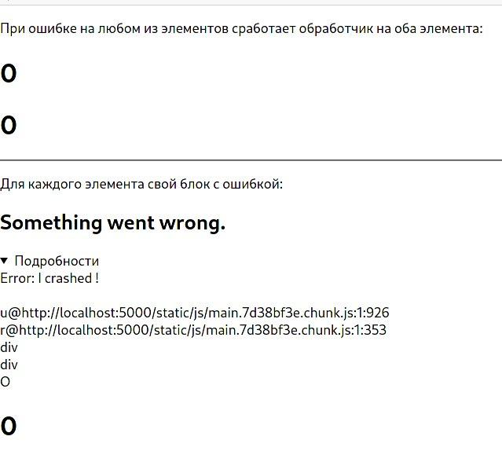
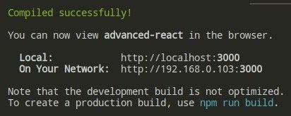
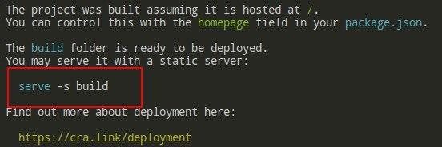
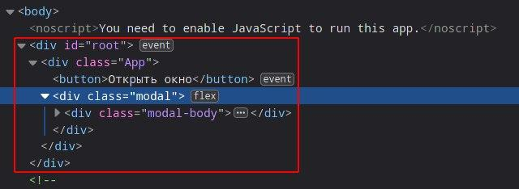
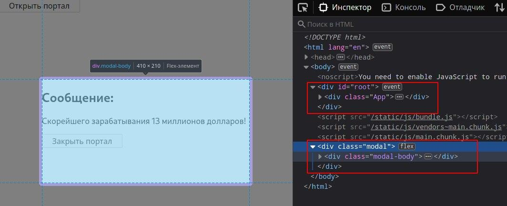

- [React продвинутый](#react-продвинутый)
  - [Фрагменты](#фрагменты)
    - [***Суть происходящего:***](#суть-происходящего)
    - [***Решение проблемы:***](#решение-проблемы)
    - [***Сокращенная запись:***](#сокращенная-запись)
    - [***Фрагменты с ключами:***](#фрагменты-с-ключами)
  - [JSX в деталях](#jsx-в-деталях)
    - [***Атрибуты расширения:***](#атрибуты-расширения)
    - [***Строковые литералы:***](#строковые-литералы)
    - [***Дочерние JSX-компоненты:***](#дочерние-jsx-компоненты)
    - [***Функции как дочерние элементы:***](#функции-как-дочерние-элементы)
  - [Предохранители (Error Boundary)](#предохранители-error-boundary)
    - [***Реальный пример:***](#реальный-пример)
    - [***Подробности:***](#подробности)
    - [***Блок try..catch:***](#блок-trycatch)
    - [***Обработчики событий:***](#обработчики-событий)
  - [Порталы](#порталы)
    - [***Пример с использованием:***](#пример-с-использованием)
  - [Роуты и редирект](#роуты-и-редирект)


# React продвинутый

## Фрагменты

### ***Суть происходящего:***
Фрагменты требуются тогда, когда нужно вернуть конкретные элементы без лишних узлов и прочего. Например код ниже приведет к ошибкам: 

```js
function App() {
  return (
    <div className="App">

      <table>
        <tbody>
        
          <tr>
            <Columns />
          </tr>

        </tbody>
      </table>

    </div>
  )
}
```

В тег `tr` нужно передать теги `td`. Компонент возвращает элемент `div` и только внутри него уже будут остальные теги:
```js
export default function Columns() {
  return (
    <div>
        <td>Максим</td>
        <td>Владислав</td>
    </div>
  )
}
```

Как быть? Элемент `tr` принимает только тег `td` и никакие другие теги вместо него не годятся, код будет не валидным. 

### ***Решение проблемы:***

Для решения этой задачи существует спец. компонент `React.Fragment`:

```js
export default function Columns() {
  return (
    <React.Fragment>
        <td>Максим</td>
        <td>Владислав</td>
    </React.Fragment>
  )
}
```

Теперь **правильным** результатом возвращения будет правильная структура:

```html
<table>
 <thbody>

  <tr>
    <td>Максим</td>
    <td>Владислав</td>
  </tr>

 </thbody>
</table>
```

### ***Сокращенная запись:***

Можно использовать сокращенную запись объявления фрагментов, выглядит как пустые теги:

```js
export default function Columns() {
  return (
    <>
      <td>Максим</td>
      <td>Владислав</td>
    </>
  )
}
```

Такая запись не годится, если нужно использовать ключи и атрибуты.

### ***Фрагменты с ключами:***

Фрагменты, объявленные с помощью `React.Fragment`, могут иметь ключи:

```js
export default function Columns(props) {
  return (
    <p>
      {props.test.map((item) => (
        // Передача ключа во фрагмент
        <React.Fragment key={item.id}>
          <dt>{item.title}</dt>
        </React.Fragment>
      ))}
    </p>
  )
}
```
***

## JSX в деталях

### ***Атрибуты расширения:***

Если есть пропсы внутри объекта `props` и его нужно передать в JSX, то можно использовать оператор расширения `...`:

```js
function App() {
  const props = { firstName: 'Влад', lastName: 'Кравич' }

  return (
    // Эти две записи абсолютно идентичны
    <div className="App">

      <JSX_All firstName="Влад" lastName="Кравич"/> 
      <JSX_All {...props} />

    </div>
  )
}
```


### ***Строковые литералы:***

Если поместить строку между открывающим и закрывающим тегом компонента, то `props.children` будет равно этой строке:

```jsx
function App() {
  const props = { firstName: 'Влад', lastName: 'Кравич' }

  return (
    <div className="App">
      <JSX_All>Тестовый литерал</JSX_All>
    </div>
  )
}

// Получаем пропс в компоненте
export default function JSX_All(props) {
  return (

    // Тестовый литерал
    <div>
      <span>{props.children}</span> 
    </div>
  )
}
```

### ***Дочерние JSX-компоненты:***

Можно указывать вложенные компоненты, которые называются дочерними:

```html
<MyContainer>
  <MyFirstComponent />
  <MySecondComponent />
</MyContainer>
```

Также в `React` можно возвращать не вложенный `div`, а массив из элементов (**обязательны ключи!**):

```jsx
function Test () {

  return [
    <li key="A">Первый</li>
    <li key="B">Второй</li>
    <li key="C">Третий</li>
  ]
}
```

### ***Функции как дочерние элементы:***

Обычно JS-выражения вставленные в JSX будут приведены к строке React элементу или списку из всего этого. 

Например, передать число в компонент и вернуть нужное кол-во элементов исходя из этого числа. В данном конкретном случае - 13 элементов `div`:

```jsx
function App() {

  return (
    <div className="App">
      <JSX_All numTimes={13}>
        { (index) => <div key={index}>Этот элемент с ключом {index}</div>}
      </JSX_All>
    </div>
  )
}


export default function JSX_All(props) {

  const items = []

  for (let i = 0; i < props.numTimes; i++) {
    items.push(props.children(i))
  }
  return <div>{items}</div>
}
```

***

## Предохранители (Error Boundary)

Предохранители - компоненты `React`, которые отлавливают ошибки JS в любом месте деревьев их дочерних элементов, сохраняют их в журнале ошибок и выводят запасной UI вместо рухнувшего дерева компонентов.  

Предохранители отлавливают ошибки при рендеринге, в методах жизненного цикла и конструкторах деревьев компонентов, расположенных под ними.

Предохранители не поймают ошибки в: 

* обработчиках событий
* асинхронном коде
* серверном рендеринге
* самом предохранителе (а не в его дочерних компонентах)

Работает только в **компоненте класса**. В реальной жизни компонент `ErrorBoundary` объявляется в компоненте и вызывается там, где он нужен. 

Чтобы стать границей ошибки, класс должен определить любой (или оба) из этих методов:

* `static getDerivedStateFromError (error)` - возвращает обновленное состояние, которое лучше всего подходит для обслуживания **резервного** пользовательского интерфейса.
* `componentDidCatch (error, errInfo)` - записывается информация об ошибках. Также можно обновить состояние (т.е. вернуть **резервный** интерфейс) здесь:

```jsx
class ErrorBoundary extends React.Component {
	constructor(props) {
		super(props)
		this.state = { hasError: false }
	}

	static getDerivedStateFromError(error) {
		// Обновить состояние, чтобы при следующем рендеринге отображался резервный интерфейс
		return { hasError: true }
	}

	componentDidCatch(error, errorInfo) {
		// Можно зарегистрировать ошибку в службе отчетов об ошибках
		logErrorToMyService(error, errorInfo)
	}

	render() {
		if (this.state.hasError) {
			// Можно отобразить любой пользовательский резервный интерфейс 
			return <h1>Произошел сбой программы, приносим извинения.</h1>
		}

		return this.props.children
	}
}
```

Затем этот **компонент** используется как обёртка для тех элементов, которые нужно застраховать:

```html
<ErrorBoundary>
  <MyComponent />
</ErrorBoundary>
```

### ***Реальный пример:***

```jsx
// Компонент ErrorBoundary
export default class ErrorBoundary extends React.Component {
  constructor(props) {
    super(props)
    this.state = { error: null, errorInfo: null }
  }

  componentDidCatch(error, errorInfo) {
    // 1) В случае ошибки заходит в этот блок и меняется стейт на стейт с ошибками
    this.setState({
      error: error,
      errorInfo: errorInfo
    })
  }

  render() {

    // 2) Теперь, если произошла какая-то ошибка - условие === true и срабатывает резервный интерфейс с выводом ошибок со стейта
    if (this.state.errorInfo) {
      return (
        <div>
          <h2>Something went wrong.</h2>
          <details style={{ whiteSpace: 'pre-wrap' }}>
            {this.state.error && this.state.error.toString()}
            <br />
            {this.state.errorInfo.componentStack}
          </details>
        </div>
      )
    }
    return this.props.children
  }
}


function BuggyCounter(props) {
  const [counter, setCounter] = useState(0)

  function handleClick() {
    setCounter(() => counter + 1)
  }

  if (counter === 3) {
    throw new Error('Я сломался, посмотреть в чём дело!')
  }
  return <h1 onClick={handleClick}>{counter}</h1>
}

function App() {
  return (
    <div className="App">
      <div>

        <ErrorBoundary>
          <p>
            При ошибке на любом из элементов сработает обработчик на оба
            элемента:
          </p>
          <BuggyCounter />
          <BuggyCounter />
        </ErrorBoundary>
        <hr />


        <p>Для каждого элемента свой блок с ошибкой:</p>
        <ErrorBoundary>
          <BuggyCounter />
        </ErrorBoundary>

        <ErrorBoundary>
          <BuggyCounter />
        </ErrorBoundary>

      </div>
    </div>
  )
}
```

Теперь при третьем клике на компонент `BuggyCounter` произойдет ошибка, которая вызовет резервный интерфейс из компонента `ErrorBoundary`:



### ***Подробности:***

Границы ошибок могут быть где угодно. Хоть в одном элементе, хоть на всю страницу целиком. 

Также, чтобы запустить отображение этого **компонента ошибки** - важно включить **производственный** режим:



Вводим команду `npm run build`, после чего видим такое окно: 



По факту нужно сделать следующее

```bash
# Запускаем продакшн
npm run build

# Ставим все нужные пакеты
sudo | npm install -g serve

# Запускаем сам сервер
serve -s
```

По дефолту при **обновлении** файлов рендер страницы не меняется. Перезапуск самого сервера `serve -s build` также не помогает.

Для решения вопросы вводим следующее и содержимое страницы обновится:

```bash
npm run build
serve -s
```

### ***Блок try..catch:***

Блок `try..catch` не сработает для рендера. Нельзя делать вот так:

```jsx
function App () {
  try {
    return (
      <BuggyCounter />
    )
  }
  catch (err) { console.log(err) }
}
```

### ***Обработчики событий:***

Компонент `ErrorBoundary` не срабатывает для ивентов. Для работы с ошибками внутри ивентов требуется использовать `try..catch`:

```jsx
handleClick() {
	try {
    // При клике произошла какая-то ошибка в коде
	} catch (error) {
		this.setState({ error })
	}
}
```
***

## Порталы

Порталы позволяют рендерить элементы, которые находятся вне элемента `root`. Т.е. портал как бы **тпшит** нужный элемент вне элемента `root`, но при этом абсолютно все события на этом партале будут срабатывать внутри `root`, будто его вовсе и не тпшнули никуда.

Порталы могут пригодиться при создании:
* модальных окон
* подсказок
* отображения ошибок и прочего.

### ***Пример с использованием:***

Нужно по клику на кнопку открыть модальное окно и закрыть его, по нажатию на окно внутри кнопки. 


Сделать это можно без особых проблем, вот только есть одно **но**: 



При таком подходе элемент лежит внутри `root` и использотать кучу `css` свойств для выравнивания модалки по центру экрана - это целый гемор.


Вместо этого можно **тпшнуть** модалку **за пределы главного** корневого элемента `root`:
```jsx
return ReactDOM.createPortal (child, container)
```
* `child`- отображаемый узел **React** (элемент | фрагмент | строка).
* `container` - в какой *именно* **DOM** элемент телепортировать


```jsx
function App() {
  const [openPortal, setOpenPortal] = useState(false)

  return (
    <div className="App">
      <button onClick={() => setOpenPortal(true)}>Открыть портал</button>
      <PortalModal isOpen={openPortal} onClose={() => setOpenPortal(false)} />
    </div>
  )

  // 1) При нажатии на кнопку "открыть" меняем стейт
  // 2) Передаём пропсы с флагом для отрисовки null
  //  и функцией изменения стейта
}


export default function PortalModal({ isOpen, onClose }) {
  if (!isOpen) return null

  return ReactDOM.createPortal(
    <div className="modal">
      <div className="modal-body">
        <h2>Сообщение:</h2>
        <p>Скорейшего зарабатывания 13 миллионов долларов!</p>
        <button onClick={onClose}>Закрыть портал</button>
      </div>
    </div>,
    document.body

  // 3) Если флаг не тру - возращаем null
  // 4) Если флаг тру, то возвращаем компонент при клике
  // на который происходит вызов функции изменения стейта
  )
}

```

И на выходе получаем модалку **вне** корневого элемента `root`, но при этом функционал остаётся ровно таким же, будто элемент никуда не перемещали:


***

## Роуты и редирект


Для начала нужно подключить реакт роутер компонент:

```bash
npm i react-router-dom
```

Затем можно подключать модули компонента в файле:

```tsx
import { BrowserRouter, Switch, Route, NavLink, Redirect } from 'react-router-dom'
```

* `BrowserRouter` - в этот компонент оборачивается всё, что должно работать с маршрутизацией
* `Switch` - останавливает рендеринг внутренних компонентов после первого совпадения
* `<Route component={ListTodo} path="/" exact />` - обработчик, который говорит, что по пути `/`, который является главным `exact` будет отрисовываться компонент `ListTodo`.

  * параметр `exact` говорит о том, что **конкретно** по этому пути перейти в такой-то компонент! 

    ```jsx
    // без exact у /month/events и всего остального переходило бы...
    // ...только в главный компонент, т.е. в /
    <Route component={Calendar} path="/" exact />
    <Route component={SingUp} path="/sing-up" exact /> 
    <Route component={Login} path="/login" exact />
    <Route component={ClickMonth} path="/month" exact />
    <Route component={TaskList} path="/month/events" exact />

    // Показать на неверном роуте этот компонент (код)
    <Route render={() => <div>There is no such page</div>} exact />
    ```
* `<NavLink to="/">` - перенаправляет на страницу без её перезагрузки. Можно прикручивать различные стили и сам **css** доступен как атрибут `a`

  * Также вместо него может использоваться обработчик `<Link>`, логика та же, только нельзя прикручивать стили.
  * Способен принимать в себя объект, который может хранить разные пути и тем самым использовать нужный путь тогда, когда требуется:

    ```jsx
    <Link
      to={{
        pathname: "/courses",
        search: "?sort=name",
        hash: "#the-hash",
        state: { fromDashboard: true }
      }}
    />

    <Link to={currentLocation => ({ ...currentLocation, pathname: "/courses" })} />
    <Link to={currentLocation => `${currentLocation.pathname}?sort=name`} />
    ```
* `<Redirect to="/test" />` - перенаправляет на другой адрес