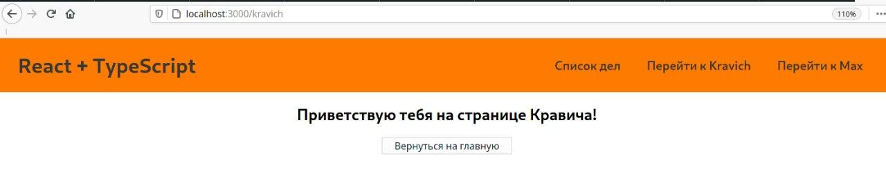

# React-TypeScript

## Установка

### ***Установка в новый проект:***

Для запуска нового проекта на full `TS` вводим следующую команду:

```bash
npx create-react-app my-rooms --template typescript
```

### ***Установка в существующий проект:***

Для добавления `TS` в существующий проект сначала его нужно установить: 

```bash
npm i --save typescript @types/node @types/react @types/react-dom @types/jest
```

После этого нужно переименовать файлы из `js` в `tsx` и в **обязательном порядке перезапустить** сервер, после чего исправить все существующие ошибки и продолжить работу.
****

## Основы

Основные `TS` функции в **React**:

1. `export const Name: React.FC = () => {}` - функциональные компоненты
2. `export class Name: React.ClassicComponent {}` - компоненты класса
3. `const keyPressHandler = (event: React.keyboardEvent<HTMLInputElement>): void => {}` - ивенты и ввод HTML

    * Для ивента нужно указывать один из типов ивента: `React.ChangeClick` и т.д. Делается это для того, чтобы во всех браузерах подразумевался один и тот же ивент без назначения подтипов.
    * Для элемента нужно указывать один из типов элемента: `<HTMLFormElement>` и т.д.
    * В передаче параметра `event` в элементе `onChange={( event: any ) => ...}` нужно указывать его тип
4. `const ref = useRef<HTMLInputElement>(null)` - указание элемента в **refs**
5. `const [flag, setFlag] = useState<string>('')` - указание типа в **useState**
6. `ref.current!.value = ''` - `!` гарантирует **TS** наличие поля у объекта ключа `value` 
7. `React.createContext<any>({})` - для `createContext` нужно передать пустой объект.
***

## Роуты

Для правильного подключения и работоспосбности роутов - нужно их подключить как: 

```bash
npm i react-router-dom
```

Поскольку роуты изначально являются `JS` файлами, то нужна библиотека для трансформации в `TS`:

```bash 
npm i @types/react-router-dom
```

Теперь можно подключить роутинг в главном файле `App.tsx` и весь роутинг будет происходить в онлайн режиме:

```tsx
import { BrowserRouter, Switch, Route } from 'react-router-dom'

const App: React.FC = () => {
  return (
    <div className="App">
      <BrowserRouter>
        <NavBar />

        <Switch>
          <Route component={ListTodo} path="/" exact />
          <Route component={Kravich} path="/kravich" />
          <Route component={Max} path="/max" />
        </Switch>

      </BrowserRouter>
    </div>
  )
}
```

Подключаем конкретный клик на конкретный компонент для отрисовки в роутинге без обновления страницы:

```tsx
import { NavLink } from 'react-router-dom'

export const NavBar: React.FC = () => {
  return (
    <div className="navbar">
      <h1>React + TypeScript</h1>

      <ul className="urlAdress">
        <li className="clickAdress">
          <NavLink to="/">Список дел</NavLink>
        </li>
        <li className="clickAdress">
          <NavLink to="/kravich">Перейти к Kravich</NavLink>
        </li>
        <li className="clickAdress">
          <NavLink to="/max">Перейти к Max</NavLink>
        </li>
      </ul>

    </div>
  )
}
```

И теперь при клике на навигацию будет рендериться тот `TSX`, который подключён к конкретному роуту:



### Переадресация

Для переадресации используется компонент `Redirect`.

Принимает два атрибута: 
* `from` - путь, с которого нужно **уйти**
* `to` - путь, на который нужно **зайти**


В функции по условию перенаправляю на начальную страницу: 

```tsx
function UserAuthorized({ authorized }: any) {
    if (!authorized) return null
    return <Redirect to="/" />
  }
```