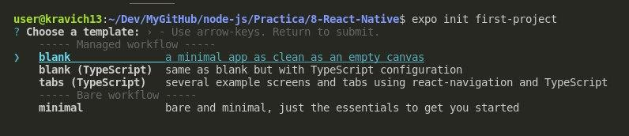
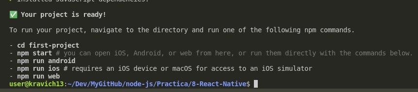

# Основы React Native

- [Основы React Native](#основы-react-native)
  - [Установка и запуск](#установка-и-запуск)
    - [Установка](#установка)
    - [Запуск приложения](#запуск-приложения)
    - [Запуск на Android](#запуск-на-android)
  - [Верстка](#верстка)
    - [Компоненты для IOS и Android](#компоненты-для-ios-и-android)
    - [Компоненты для IOS](#компоненты-для-ios)
    - [Стилизация](#стилизация)
    - [Подключение шрифтов](#подключение-шрифтов)
    - [Проверка платформ](#проверка-платформ)
  - [Ивенты](#ивенты)

## Установка и запуск

Для того, чтобы работать с React Native - нужен установленный Expo, на котором можно эмулировать работу Android и IOS. 

Если есть только линукс или винда, то эмулятор можно запустить только на Android. Если есть айфон - то можно транслировать проект на нём. 

### Установка


Устанавливаем Expo:

```bash
sudo npm install --global expo-cli
```

Устанавливаем сам проект в конкретную папку:

```
expo init my-project
```

Появляется такое окно с выбором:



Можно выбрать либо: 
1. Без TypeScript
2. С TypeScript
3. Для навигации с Typescript
4. Самая минимальная конфигурация

### Запуск приложения

После установки будут доступны различные вариации запуска проекта:



При запуске `npm start` предложит перейти на `localhost:19002`, переходим и видим следующее:


Можно запустить проект как:
* эмулятор на Android
* эмулятор IOS

С помощью кьюар кода можно запустить приложение на телефоне с прогой `expo go`. 

### Запуск на Android

Для установки Android эмулятора скачиваем android studio.

Переходим в `more options`, выбираем в `AVD manager`. Создаём устройство, которое помечено галочкой play market и выбираем. 
Запуск эмулятора происходит через кнопку `play` (зеленая).

Затем во вкладке локалхоста нажимаем Run on Android device/emulator и эмулятор андроида успешно запускается. 
***

## Верстка

### Компоненты для IOS и Android

Самое главное отличие React Native от React в том, что здесь нет `HTML` тегов, здесь есть специальные функции обёртки, которые генерируют код под android и ios. 

Список модулей, используемых для генерации элементов: 

* `View` - аналог `<div>`, есть закрывающий тег
* `ScrollView` - есть закрывающий тег. Позволяет прокручивать контент, если он вылазит за высоту окна
* `Text` - аналог `<p>`, есть закрывающий тег. 

  Для перевода строки нужен или ещё один тег, или указать `js<Text>Новая {'\n'}строка</Text>`

  Новые атрибуты: 
  * `numberOfLines` - можно установить кол-во отображаемых строк
* `TextInput` - аналог `<input>`, нет закрывающего тега

  Новые атрибуты: 
  * `onChangeText` - возвращает введенный текст
  * `autoCorrect` - по дефолту включён T9 (`true`), `false` чтобы выключить
  * `autoCapitalize` - по дефолту большая первая буква в предложении, `none` - выключить

* `Button` - аналог `<button>`, нет закрывающего тега
 
  Новые атрибуты: 
  * `title` - принимает текст кнопки
  * `onPress` - ивент клика

* `Alert` - аналог `alert`, нет закрывающего тега. Используется для алертов и промптов. 

  * `.alert()` - показывает алерт. Принимает три параметра: 1 - title (жирный), 2 - сообщение, 3 - массив объектов внутренних кнопок: `[{ text: 'Согласен?', onPress: () => {} }]`. 


* `Image` - аналог `image`, нет закрывающего тега. 

  Новые атрибуты: 
  * `source` - принимает картинку или ссылку на картинку. С обычной картинкой - путь `import ./image.png`, в случае с инета - `{ width: 200, height: 150, uri: link }`
  * `blurRadius` - расплывчатость картинки, указывается в числах

* `FlatList` - создан специально для списков чего-то, где много элементов. Позволяет не отрисовывать все его элементы сразу, а отрисовывает лишь те из них, которые доступны по высоте экрана. Что не влазит - просто держит в памяти

  Новые атрибуты: 
  * `data` - принимает входящий стейт
  * `renderItem` - возвращает callback с собственными полями и в нём же нужно вернуть элемент на один объект стейта (как обычный `.map`)
  
  * `keyExtractor` - как `key`, только возвращает callback с собственными полями и здесь нужно вернуть поля с `id`. 

    Пример: 
    ```jsx
    <FlatList
      data={todos}
      renderItem={({ item }) => {
        return <Todo todo={item} />;
      }}
      keyExtractor={(item) => item.id}
    />
    ```

### Компоненты для IOS

* `SafeAreaView` - нет аналога, есть закрывающий тег. Если обычный `View` начинается с положения `X(0), Y(0)` всегда, то этот тег высчитывает начальную высоту в зависимости от высоты статус бара и его содержимое не налезет на него
* `Alert.prompt()` - показывает окно для ввода с кнопками. Принимает те же 2 параметра, что и `.alert()`. 3 аргумент - `callback`, который возвращает введенный текст.

### Стилизация

В обычном React есть объект `styles`, в который записываются свойства полей. В React-Native юзается почти то же самое:

```jsx
export default function App() {
  return (
    <View style={styles.container}>
      <Text style={styles.text}>Maxim is god</Text>
      <StatusBar style="auto" />
    </View>
  );
}

const styles = StyleSheet.create({
  container: {
    flex: 1,
    backgroundColor: 'rgb(1,73,73)',
    alignItems: 'center',
    justifyContent: 'center',
  },
  text: {
    color: 'white'
  }
});
```

Расположение компонентов по дефолту реализовано на `flex`, здесь нет никаких `displayBlock`. Чтобы установить `flex` - нужно юзать `number`:

```js
flex: 1 // занять 1 / кол-ва высоты/ширины элементов 
flex: 2 // занять 2 / кол-ва высоты/ширины элементов 
flex: 3 // занять 3 / кол-ва высоты/ширины элементов 
```

Также можно указывать стили напрямую в атрибуте `style`, но подсказок уже не будет. 

Стандартные стили для `border` задаются так:

```js
input: {
  borderWidth: 1,
  borderStyle: 'solid',
  borderColor: 'black',
},
```

Если нужно передать **несколько стилей** к одному атрибуту - то это нужно делать через массив: `style={[ obj1, obj2 ]}`. 

### Подключение шрифтов

Скачать шрифты можно отсюда: https://fonts.google.com/

Устанавливаем: 

```bash
npm i expo-font expo-app-loading
```

И подключаем теперь всё вместе: 

```jsx
import AppLoading from 'expo-app-loading';
import { useFonts } from 'expo-font';
import { StatusBar } from 'expo-status-bar';
import { Platform, StyleSheet, Text, View } from 'react-native';

export default function App() {
  const [fontsLoader] = useFonts({
    'mt-bold': require('./assets/fonts/Montserrat-Bold.ttf'),
    'mt-light': require('./assets/fonts/Montserrat-Light.ttf'),
  });

  if (fontsLoader) {
    return (
        <View style={styles.container}>
          <StatusBar style="auto" />
          <Text style={styles.text}>Kravich</Text>
        </View>
    );
  } else {
    return <AppLoading />;
  }
}

const styles = StyleSheet.create({
  container: {
    paddingHorizontal: Platform.OS === 'android' ? 30 : 10,
  },
  text: {
    fontFamily: 'mt-bold', // название такое же, как указывали key внутри useFonts
  },
});
```

При загрузке шрифтов из хука - показываем всё содержимое. Если шрифты не готовы - показываем `AppLoader`. 

### Проверка платформ

Для того, чтобы узнать на какой платформе сейчас находимся, версию прошивки и т.д. - используется компонент `Platform`. 

Есть следующие методы: 
* `OS` - android | ios | macos  | web | windows
* `Version` - версия прошивки
* `isPad` - является ли айпадом
* `isTV` - является ли телевизором
* `isTVOS` - является ли телевизором с определенной OS
* `isTesting`
* `constants` 


## Ивенты

Для того, чтобы добавить ивенты на обычные элементы - их нужно оборачивать в специальные компоненты Native. 

* `TouchableOpacity` - используется для длинных нажатий. 

```jsx
import React from 'react';
import { StyleSheet, Text, TouchableOpacity, View } from 'react-native';

export const Item = ({ item, removeItem }) => {
  return (
    <TouchableOpacity activeOpacity={0.5} onLongPress={() => removeItem(item.id)}>
      <View style={styles.item}>
        <Text style={styles.title}>{item.title}</Text>
      </View>
    </TouchableOpacity>
  );
};
```

* `TouchableHighlight` - используется для обычных нажатий там, где `onPress` в атрибутах компонентов отсутствует. Добавляет эффект подсветки при нажатии и не всегда подходит
  
* `TouchableWithoutFeedBack` - то же самое, только без эффекта подсветки

