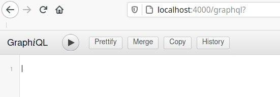
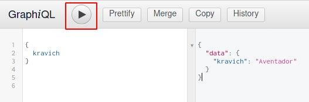
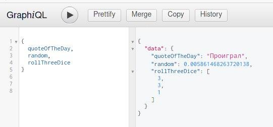
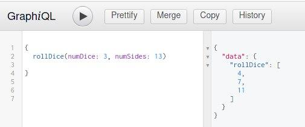
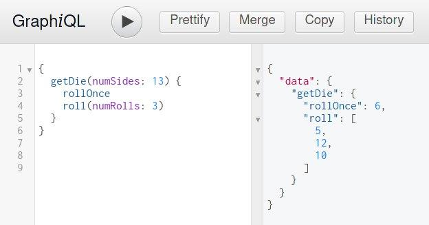
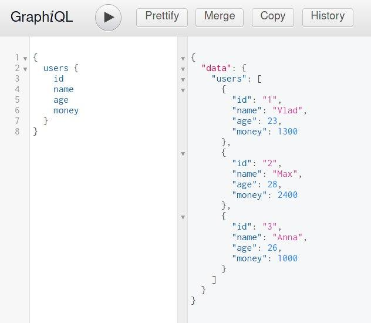
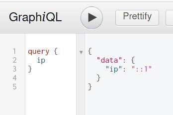

- [GraphQL](#graphql)
  - [Основы](#основы)
    - [***Установка и запуск:***:](#установка-и-запуск)
    - [***Запуск с express:***](#запуск-с-express)
    - [***Отправка запроса от клиента:***](#отправка-запроса-от-клиента)
    - [***.graphql:***](#graphql-1)
  - [Основные типы](#основные-типы)
    - [***Передача аргументов:***](#передача-аргументов)
    - [**Определение запроса, отправка на сервер и получение данных запроса от клиента:**](#определение-запроса-отправка-на-сервер-и-получение-данных-запроса-от-клиента)
  - [Типы объектов](#типы-объектов)
    - [***Получение массива объектов:***](#получение-массива-объектов)
  - [Мутации и типы ввода](#мутации-и-типы-ввода)
    - [***Определения в GraphiQL:***](#определения-в-graphiql)
    - [***Клиентская сторона:***](#клиентская-сторона)
  - [Аутентификация и промежуточное ПО](#аутентификация-и-промежуточное-по)
    - [***Пример из чата:***](#пример-из-чата)

# GraphQL

## Основы

`GraphQL` - это язык, который используется для взаимодействия с сервером для получения конкретных данных. Здесь можно передать только те данные, которые нужны для получения, ни больше, ни меньше. 

В `Rest` обычно получают полный объём данный, который вполне излишен.

### ***Установка и запуск:***:

```bash
npm i graphql  
```

Теперь определим схему в `app.js`:

```js
const { graphql, buildSchema } = require("graphql")

// Схема построенная на graphQL
const schema = buildSchema(`
    type Query {
        kravich: String
    }
`)

// Просто объект с методом kravich
const root = {
    kravich: () => {
        return "Aventador"
    }
}

// Запускаем запрос GraphQL '{ kravich }' и распечатываем ответ 
graphql(schema, "{ kravich }", root).then((response) => {
    console.log(response)

    // В консоли терминала выведется следующее: 
    // { data: [Object: null prototype] { kravich: 'Aventador' } }
})
```


### ***Запуск с express:***

Для этого нужно установить граф и `express` модуль графа:

```bash
npm i graphql 
npm i express-graphql 
```

Теперь по адресу `/graphql` будет выдавать спец. форму, где можно получать различные данные:

```javascript
const express = require('express');
const app = express();
const { graphqlHTTP } = require('express-graphql')
const { buildSchema } = require('graphql')

const schema = buildSchema(`
  type Query {
    kravich: String
  }
`) 

const root = {
  kravich: () => {
    return 'Aventador'
  },
}

app.use('/graphql', graphqlHTTP({
  schema: schema,
  rootValue: root,
  graphiql: true
}))

app.listen(4000)
```

По переходу на `/graphql` будет следующее: 



В текстовое поле (там где цифра 1) вводим запрос, нажимаем на кнопку **запуска** и получаем результат из `root`:



### ***Отправка запроса от клиента:***

Также можно отправить запрос от клиента на `graphQL`:

```js
run ()
async function run() {
  const res = await fetch('/graphql', {
      method: 'POST',
      headers: {
        'Content-Type': 'application/json',
        'Accept': 'application/json',
      },
      body: JSON.stringify({
        query: "{ kravich }"
      })
    })
    const result = await res.json()
    console.log(result)
    // data: Object { kravich: "Aventador" }
}
```

### ***.graphql:***

Можно определять и подключать схемы из расширения `.graphql` и подключать этот файл следующим образом:

```bash
# schema.graphql

type Query {
  kravich: String
}
```

```js
const schemaString = redFileSync("./schema.graphql", { encoding: "utf8" })

const schema = buildSchema(schemaString)
```

*** 

## Основные типы

Язык схемы `GraphQL` поддерживает скалярные типы: 
  * `String`
  * `Ing`
  * `Float`
  * `Boolean`
  * `ID`

По дефолту каждый из типов допускает значение `NULL`. Чтобы изменить такое поведение и запретить возвращать `NULL` - нужно к типу добавить `String!`. Т.е. при таком подходе `GraphSQL` должен **обязательно** вернуть значение к этому типу.

При помещении типа в `[Int]` будет означать, что по такому запросу ожидается получить массив. Иначе - `null`. 

```javascript
// строка
// число с запятым
// массив целых чисел

const schema = buildSchema(`
  type Query {
    quoteOfTheDay: String
    random: Float!
    rollThreeDice: [Int]
  }
`)

const root = {
  quoteOfTheDay: () => {
    return Math.random() < 0.5 ? "Проиграл" : 'Победил'
  },
  random: () => {
    return Math.random()
  },
  rollThreeDice: () => {
    return [1, 2, 3].map( () => 1 + Math.floor(Math.random() * 6))
  },
}
```

По запросу `rollThreeDice` возвращает массив челых чисел. Если убрать `[]` - вернёт `null`: `"rollThreeDice": null`.


***

### ***Передача аргументов:***

Также по запросу может быть не статичный код, а динамическая функция с параметрами. Например, можно указать в запросе, что нужно получить массив из `N` числа с рандомом до `N` числа:

```js
const schema = buildSchema(`
  type Query {
    rollDice(numDice: Int!, numSides: Int): [Int]
  }
`)

const root = {
  // принимает объект с параметрами:
  // длина массива и макс. число в рандоме
  rollDice: ({ numDice, numSides }) => {

    const output = []
    for (let i = 0; i < numDice; i++) {
      output.push(1 + Math.floor(Math.random() * (numSides || 6)));
    }
    return output;
  }
}
```
Передаём в запрос вызов функции, где хотим получить 3 числа в массиве и с макс. числом рандома 13:




### **Определение запроса, отправка на сервер и получение данных запроса от клиента:**

Отправка запроса от клиента - это значит, что нужно просто указать, какие именно данные нужно получить. **Нужно просто написать ровно то же самое, что и в клиенте `graphiQL`:**

```js
run()
async function run() {

  let dice = 5;
  let sides = 13;

  // То же самое, что я бы писал в graphiQL
  const query = `query RollDice($dice: Int!, $sides: Int) {
    rollDice(numDice: $dice, numSides: $sides)
  }`

  const res = await fetch('/graphql', {
      method: 'POST',
      headers: {
        'Content-Type': 'application/json',
        'Accept': 'application/json',
      },
      body: JSON.stringify({
        query,
        variables: { dice, sides },
      })
    })
  
  const result = await res.json()
  console.log(result)

  // rollDice: (5) [1, 13, 3, 11, 3]
}
```
***
## Типы объектов

Можно вернуть сложный объект вместо определенного типа:

```js
// 1) определение схемы с начальным объектом Query и новым объектом Random
var schema = buildSchema(`
  type RandomDie { 
    numSides: Int!
    rollOnce: Int!
    roll(numRolls: Int!): [Int]
  }
 
  type Query {
    getDie(numSides: Int): RandomDie
  }
`)

class RandomDie {
  
  constructor(numSides) {
    this.numSides = numSides;
  }

  rollOnce () {
  // 2) объект класса, который возвращает рандомное число
    return 1 + Math.floor(Math.random() * this.numSides );
  }

  roll ( {numRolls} ) {
    const output = []
    
    for (let i = 0; i < numRolls; i++) {
      output.push(this.rollOnce())
    }
    // возвращает кол-во рандомных чисел
    return output
  }
}

const root = {
  // если число true - вернуть переданное число, если нет - вернуть 6
  getDie: ( {numSides} ) => {
    return new RandomDie(numSides || 6)
  }
}
```

1. Определяется новый класс объекта `RandomDie`, который:
    * возвращает рандомное число;
    * возвращает кол-во рандомных чисел.
2. В объекте `root` определяется метод `getDie`, в который передаётся макс. число для рандома.
3. Определяем схему, по которой будет производиться запрос. 


По сути, в объект `query` передаётся параметр с рандомным числом, в который затем вкладываются встроенные методы класса `RandomDie`:


***

### ***Получение массива объектов:***

Самая базовая задача с БД - получение данных таблиц/документов в виде массива объектов:

```js
// Передача массива users в качестве результата в query
const schema = buildSchema(`
  type Users {
    id: ID!
    name: String!
    age: Int!
    money: Int!
  }
  type Query {
    users: [Users]!
  }
`)

// массив объектов с полями
const users = [{
    id: 1,
    name: 'Vlad',
    age: 23,
    money: 1300,
  },
  {
    id: 2,
    name: 'Max',
    age: 28,
    money: 2400,
  },
  {
    id: 3,
    name: 'Anna',
    age: 26,
    money: 1000,
  }
]

const root = {
  users: users
}
```


***

## Мутации и типы ввода

Мутации - это добавление, изменение или удаление данных. Т.е. работа уже с существующими данными.

Для мутации определяется своя схема под `type Mutation`, в которую записываются методы с полями из объекта `root`:

```js
const schema = buildSchema(`
  input MessageInput {
    content: String
    author: String
  }
 
  type Message {
    id: ID!
    content: String
    author: String
  }
 
  type Query {
    getMessage(id: ID!): Message
  }
 
  type Mutation {
    createMessage(input: MessageInput): Message
    updateMessage(id: ID!, input: MessageInput): Message
  }
`);
 
const Message { 
  constructor(id, { content, author }) {
    this.id = id
    this.content = content
    this.author = author
  }
}
 
const fakeDatabase = {}
let countI = 1
 
const root = {
  // 1) обычная схема Query:
  getMessage: ({ id }) => {

    if (!fakeDatabase[id]) {
      throw new Error(`no message exists with id ${id}`)
    }
    return new Message(id, fakeDatabase[id])
  },

  // 2) Мутация с добавлением в БД:
  createMessage: ({ input }) => {
    var id = countI++
 
    fakeDatabase[id] = input
    return new Message(id, input)
  },

  // 3) Мутация с изменением из БД:
  updateMessage: ({ id, input }) => {
    
    if (!fakeDatabase[id]) {
      throw new Error(`no message exists with id ${id}`)
    }
    fakeDatabase[id] = input
    return new Message(id, input)
  }
}
```
### ***Определения в GraphiQL:***
```bash
# 1) Добавит новые данные в БД:

# mutation {
#   createMessage( input: {
# 		author: "Kravich"
# 		content: "test"
# 	})
# 	 {
# 	 id
# 	 author
# 	 content
# 	 }
# }


# 2) Изменит данные по конкретному ID из БД:

# mutation {
#   updateMessage(id:"13", input: {
# 		author: "Kravich"
# 		content: "qq 13 million dollars"
# 	})
# 	 {
# 	 id
# 	 author
# 	 content
# 	 }
# }


# 3) Получит данные по конкретному ID:

# query {
#  getMessage(id: "13") {
# 	author	
# 	content
# 	}
# }
```

### ***Клиентская сторона:***

```js
let author = 'andy';
let content = 'hope is a good thing';
let query = `mutation CreateMessage($input: MessageInput) {
  createMessage(input: $input) {
    id
    author
    content
  }
}`

run()
async function run() {

  const res = await fetch('/graphql', {
    method: 'POST',
    headers: {
      'Content-Type': 'application/json',
      'Accept': 'application/json',
    },
    body: JSON.stringify({
      query,
      variables: {
        input: {
          author,
          content,
        }
      }
    })
  })

  const result = await res.json()
  console.log(result)

  // createMessage: Object {
  //   id: "2",
  //   author: "andy",
  //   content: "hope is a good thing"
  // }
}
```
*** 

## Аутентификация и промежуточное ПО

В **GraphQL** можно создавать промежуточный обработчик и передавать из него данные с помощью `next()` в объект `root` для дальнейших манипуляций:

```js
const schema = buildSchema(`
  type Query {
    ip: String
  }
`)

// 1) Сам промежуточный обработчик
const loggingMiddleware = (req, res, next) => {
  console.log(req.ip)
  next()
}

// 2) Next передаёт сюда данные из req
const root = {
  ip: function (args, req) {
    return req.ip
  }
}

// 3) И здесь срабатаывает обработчик use
app.use(loggingMiddleware)
```


### ***Пример из чата:***

```js
const root = {
  getRoom: async function ({nameRoom}, req) {
    console.log(req) // доступен весь req

    if (nameRoom === "713dbhqpo666") {
      return await gettingDataInTables(allTableInSQL[arrNamesTables[0]])
    }
    return await gettingDataInTables(allTableInSQL[nameRoom])
  },
  allRoom: () => {
    return arrNamesTables
  }
}

// и здесь также можно передать всё параметром
app.use("/rooms", loggingMiddleware, graphqlHTTP({ 
  schema: schema,
  rootValue: root,
  // graphiql: true
}))
```