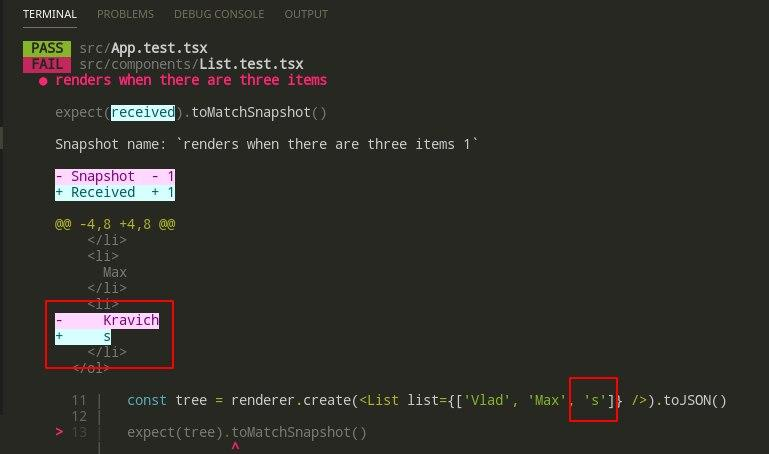

- [Snapshot](#snapshot)
  - [Основы](#основы)
    - [*Установка и запуск:*](#установка-и-запуск)
    - [*Основные команды терминала*](#основные-команды-терминала)
    - [*Адаптивные снимки*](#адаптивные-снимки)
    - [*Валидация*](#валидация)

# Snapshot

Snapshot - тестирование с помощью снимков. Т.е. он делает снимок того, что должно быть выведено на экран (в виде `html` тегов) и сверяет с тем, что выводит на текущий момент. 


## Основы

### *Установка и запуск:*

Устанавливаем: 

```bash
npm i react-test-renderer
```

Сносим весь дефолтный файл `App.test.tsx`.  

Подключаем библиотеку и пишем следующее:

```tsx
import renderer from 'react-test-renderer'
import { App } from './App'

it('renders correctly', () => {
  const tree = renderer.create(<App />).toJSON()
  expect(tree).toMatchSnapshot()
})
```

* Метод `it` заменяет собой `test`
* Для создания снимка нужно вызвать `renderer.create` и передать в него сам компонент и его пропсы (если есть), затем нужно записать в формат `JSON`
* Для тестов используем метод `toMatchSnapshot()`

Т.е. можно передавать разные пропсы, параметры и смотреть, что должно быть на выходе. Если переданные данные выводят ровно ту же строку, что и первоначальный рабочий снимок - валидация прошла успешно. 

### *Основные команды терминала*

По нажатию на `w` выпадет следующее: 

```bash
# Запуск всех тестов
› Press a to run all tests. 

# Запуск неудавшихся тестов
› Press f to run only failed tests. 

# Выйти из режима часов
› Press q to quit watch mode. 

# выполнить фильтрация по рег. выр. имени файла
› Press p to filter by a filename regex pattern. 

# Выполнить фильтрацию по рег. выр. имени теста
› Press t to filter by a test name regex pattern. 

# Обновить ошибочные снимки
› Press u to update failing snapshots 

# Обновить ошибочные снимки в интерактивном режиме 
› Press i to update failing snapshots interactively
``` 

### *Адаптивные снимки*

Компоненты могут принимать разные параметры и соотственно - финальный снимок может быть разным (в массиве 0 аргументов, 10 или 100). 

Для включения адаптивного режима нажимаем `i` в терминале.

Пример: 

```tsx
import React from 'react'

export const List: React.FC<any> = ({ list }) => {
  if (list.length < 0) return <div>No items in list</div>
  return (
    <ol>
      {list.map((title: string, index: number) => {
        return <li key={index}>{title}</li>
      })}
    </ol>
  )
}
```

* массив `list` представляет собой массив строк. 


Теперь в тесте: 

```tsx
import renderer from 'react-test-renderer'
import { List } from './List'

it('renders when there are not items', () => {
  const tree = renderer.create(<List list={[]} />).toJSON()

  expect(tree).toMatchSnapshot()
})

it('renders when there are three items', () => {
  const tree = renderer
    .create(<List list={['Vlad', 'Max', 'Kravich']} />)
    .toJSON()

  expect(tree).toMatchSnapshot()
})
```

* В первом тесте передаём `[]` и снимок один
* Во втором передаём массив с множеством элементво и это работает

Сам первоначальный снимок: 

```js
exports[`App other renders correctly 1`] = `
<div
  className="App"
>
  <ol>
    <li>
      Vlad
    </li>
    <li>
      Max
    </li>
    <li>
      Kravich
    </li>
  </ol>
</div>
`;
```

### *Валидация*

Если передать параметр несоответствующий первому снимку - будет ошибка.



* третий параметр массива - `'s'`, а должен быть `'Kravich'`. 