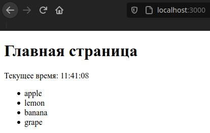

- [Хелперы в Handlebar](#хелперы-в-handlebar)


# Хелперы в Handlebar

Хелперы фактически представляют функции, которые возвращают некоторую строку. После получения эту строку можно добавить в любое место представления. Строка может представлять собой в том числе и `html` код.

Хелперы позволяют оптимизировать создание кода представлений. В частности, мы можем один раз определить функцию хелпера, а затем многократно применять ее в самых различных местах для генерации кода.

Изменим `app.js`:

```javascript
const express = require("express")
const hbs = require("hbs")
const app = express()


hbs.registerHelper("getTime", function () {

    var myDate = new Date();
    var hour = myDate.getHours();
    var minute = myDate.getMinutes();
    var second = myDate.getSeconds();

    if (minute < 10) {
        minute = "0" + minute;
    }
    if (second < 10) {
        second = "0" + second;
    }

    return "Текущее время: " + hour + ":" + minute + ":" + second;
})


hbs.registerHelper("createStringList", function (array) {

    var result = ""

    for (var key of array) {
        result += `<li>${key}</li>`
    }

    return new hbs.SafeString(`<ul>${result}</ul>`)
})

app.set("view engine", "hbs")

app.use("/", function (request, response) {
    
    response.render("home.hbs", {
        fruit: [ "apple", "lemon", "banana", "grape"]
    })
})

app.listen(3000)
```

Хелпер определяется до включения модуля `hbs` с помощью функции `hbs.registerHelper`, у которой два параметра:

1.  название хелпера (то, что вставляется `html` как `{{qq}}`).
2.  функция, которая возвращает строку.


**Здесь добавлено определение хелпера `createStringList()`, который в качестве параметра принимает некоторый массив строк и из них создает элемент `"<ul>"`. Однако чтобы возвращаемое значение расценивалось именно как `html`, его надо обернуть в функцию `hbs.SafeString()`.**

Теперь определим представление в `views/home.hbs`:

```html
<!DOCTYPE html>
<html>
<head>
    <title>Главная страница</title>
    <meta charset="utf-8" />
</head>
<body>
    
    <h1>Главная страница</h1>
    <div>{{getTime}}</div>

    <div>{{createStringList fruit}}</div>
    
</body>
<html>
```


Результат: 



**При этом, определив хелпер один раз, можно его использовать многократно в различных представлениях, передавая ему различные значения.**